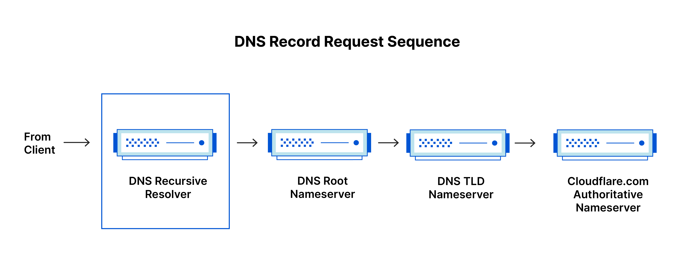
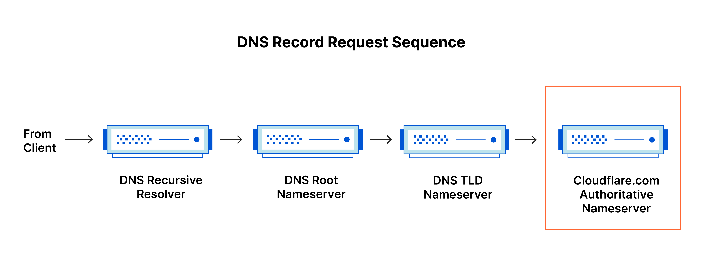
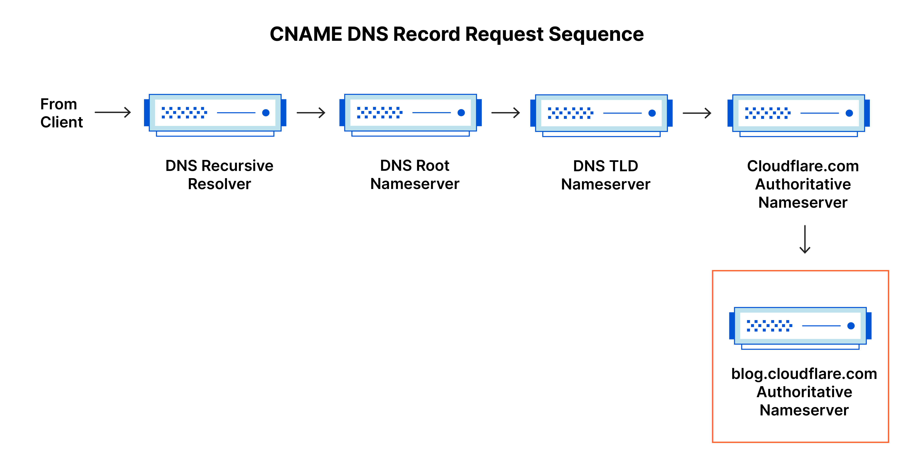
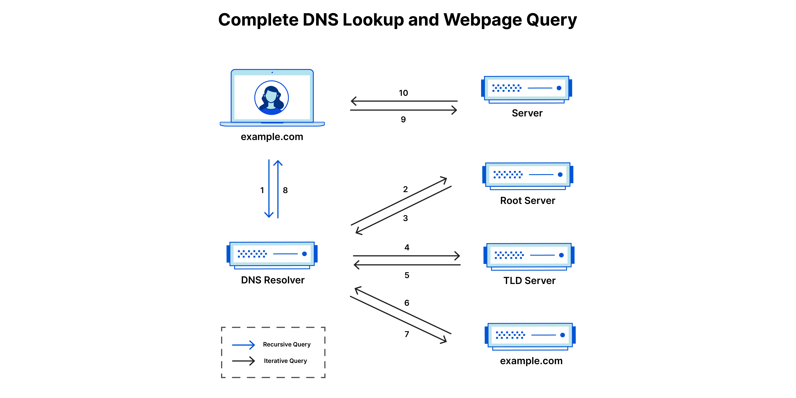
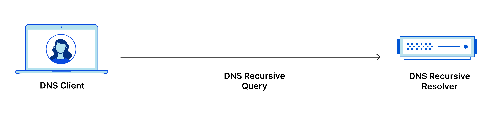

# Что такое DNS?

Система доменных имен (DNS) — это телефонная книга Интернета. Люди получают доступ к информации в Интернете через [доменные имена](https://www.cloudflare.com/learning/dns/glossary/what-is-a-domain-name/) , такие как nytimes.com или espn.com. Веб-браузеры взаимодействуют через адреса [интернет-протокола (IP)](https://www.cloudflare.com/learning/network-layer/internet-protocol/) . DNS преобразует доменные имена в IP-адреса , чтобы браузеры могли загружать интернет-ресурсы.

Каждое устройство, подключенное к Интернету, имеет уникальный IP-адрес, который другие машины используют для поиска устройства. DNS-серверы избавляют людей от необходимости запоминать IP-адреса, такие как 192.168.1.1 (в IPv4), или более сложные новые буквенно-цифровые IP-адреса, такие как 2400:cb00:2048:1::c629:d7a2 (в IPv6).

## Как работает DNS?
Процесс разрешения DNS включает преобразование имени хоста (например, www.example.com) в удобный для компьютера IP-адрес (например, 192.168.1.1). Каждому устройству в Интернете присваивается IP-адрес, и этот адрес необходим для поиска соответствующего интернет-устройства — так же, как уличный адрес используется для поиска конкретного дома. Когда пользователь хочет загрузить веб-страницу, должен произойти перевод между тем, что пользователь вводит в свой веб-браузер (example.com), и машиночитаемым адресом, необходимым для поиска веб-страницы example.com.

Чтобы понять процесс разрешения DNS, важно узнать о различных аппаратных компонентах, между которыми должен проходить DNS-запрос. Для веб-браузера поиск DNS происходит «за кулисами» и не требует никакого взаимодействия с компьютером пользователя, кроме первоначального запроса.

## В загрузке веб-страницы участвуют 4 DNS-сервера:
1. [Рекурсор DNS](https://www.cloudflare.com/learning/dns/dns-server-types/) . Рекурсор можно рассматривать как библиотекаря, которого просят найти определенную книгу где-нибудь в библиотеке. Рекурсор DNS — это сервер, предназначенный для получения запросов от клиентских компьютеров через такие приложения, как веб-браузеры. Обычно рекурсор затем отвечает за выполнение дополнительных запросов для удовлетворения DNS-запроса клиента.
2. Корневой сервер имен. Корневой [сервер](https://www.cloudflare.com/learning/dns/glossary/dns-root-server/) — это первый шаг в преобразовании (разрешении) удобочитаемых имен хостов в IP-адреса. Его можно рассматривать как указатель в библиотеке, указывающий на разные стойки с книгами — обычно он служит ссылкой на другие, более конкретные места.
3. [Сервер имен TLD](https://www.cloudflare.com/learning/dns/dns-server-types/) . Сервер домена верхнего уровня ( TLD ) можно рассматривать как определенную стойку с книгами в библиотеке. Этот сервер имен является следующим шагом в поиске определенного IP-адреса и содержит последнюю часть имени хоста (в example.com сервером TLD является «com»).
4. [Авторитетный сервер имен](https://www.cloudflare.com/learning/dns/dns-server-types/) . Этот последний сервер имен можно рассматривать как словарь на полке с книгами, в котором конкретное имя может быть переведено в его определение. Авторитетный сервер имен является последней остановкой в ​​запросе сервера имен. Если авторитетный сервер имен имеет доступ к запрошенной записи, он вернет IP-адрес запрошенного имени хоста обратно рекурсору DNS (библиотекарю), который сделал первоначальный запрос.

## В чем разница между авторитетным DNS-сервером и рекурсивным DNS-преобразователем?
Обе концепции относятся к серверам (группам серверов), которые являются неотъемлемой частью инфраструктуры DNS, но каждый из них выполняет разные роли и находится в разных местах внутри конвейера DNS-запроса. Один из способов понять разницу: [рекурсивный](https://www.cloudflare.com/learning/dns/what-is-recursive-dns/) преобразователь находится в начале DNS-запроса, а авторитетный сервер имен — в конце.

### Рекурсивный преобразователь DNS
Рекурсивный преобразователь — это компьютер, который отвечает на рекурсивный запрос от клиента и тратит время на отслеживание [записи DNS](https://www.cloudflare.com/learning/dns/dns-records/) . Он делает это, выполняя серию запросов, пока не достигнет авторитетного DNS-сервера имен для запрошенной записи (или истечет время ожидания, или не вернется ошибка, если запись не найдена). К счастью, рекурсивным преобразователям DNS не всегда требуется выполнять несколько запросов для отслеживания записей, необходимых для ответа клиенту; [кэширование](https://www.cloudflare.com/learning/cdn/what-is-caching/) — это процесс сохранения данных, который помогает сократить необходимые запросы, предоставляя запрошенную запись ресурса ранее при поиске DNS.

### Авторитетный DNS-сервер
Проще говоря, авторитетный DNS-сервер — это сервер, который фактически хранит записи ресурсов DNS и отвечает за них. Это сервер в нижней части цепочки поиска DNS, который ответит запрошенной записью ресурса, что в конечном итоге позволит веб-браузеру, выполняющему запрос, получить IP-адрес, необходимый для доступа к веб-сайту или другим веб-ресурсам. Авторитетный сервер имен может удовлетворять запросы на основе своих собственных данных без необходимости запрашивать другой источник, поскольку он является окончательным источником истины для определенных записей DNS.

Стоит отметить, что в тех случаях, когда запрос предназначен для субдомена, такого как [foo.example.com или blog.cloudflare.com , в последовательность будет добавлен дополнительный сервер имен после авторитетного сервера имен, который отвечает за хранение записи CNAME](https://blog.cloudflare.com/) субдомена. .

Существует ключевое различие между многими службами DNS и службами Cloudflare. Различные рекурсивные преобразователи DNS, такие как Google DNS, OpenDNS и такие провайдеры, как Comcast, поддерживают установки рекурсивных преобразователей DNS в центрах обработки данных. Эти преобразователи позволяют быстро и легко выполнять запросы через оптимизированные кластеры компьютерных систем, оптимизированных для DNS, но они фундаментально отличаются от серверов имен, размещенных на Cloudflare.

Cloudflare поддерживает серверы имен на уровне инфраструктуры, которые являются неотъемлемой частью функционирования Интернета. Одним из ключевых примеров является сеть [серверов f-root](https://blog.cloudflare.com/f-root/) , за хостинг которой частично отвечает Cloudflare. F-root — это один из компонентов инфраструктуры DNS-сервера корневого уровня, отвечающий за миллиарды интернет-запросов в день. Наша [сеть Anycast](https://www.cloudflare.com/learning/cdn/glossary/anycast-network/) дает нам уникальную возможность обрабатывать большие объемы DNS-трафика без перебоев в обслуживании.

## Каковы этапы поиска DNS?
В большинстве ситуаций DNS занимается преобразованием доменного имени в соответствующий IP-адрес. Чтобы узнать, как работает этот процесс, полезно проследить путь поиска DNS при его прохождении от веб-браузера через процесс поиска DNS и обратно. Давайте посмотрим на шаги.

Примечание. Зачастую информация поиска DNS кэшируется либо локально внутри запрашивающего компьютера, либо удаленно в инфраструктуре DNS. Обычно поиск DNS состоит из 8 шагов. Когда информация DNS кэшируется, шаги процесса поиска DNS пропускаются, что ускоряет его. В приведенном ниже примере показаны все 8 шагов, когда ничего не кэшируется.

8 шагов поиска DNS:
1. Пользователь вводит «example.com» в веб-браузер, запрос передается в Интернет и принимается рекурсивным преобразователем DNS.
2. Затем преобразователь запрашивает корневой DNS-сервер имен (.).
3. Затем корневой сервер отвечает преобразователю адресом DNS-сервера домена верхнего уровня (TLD) (например, .com или .net), который хранит информацию для своих доменов. При поиске example.com наш запрос указывает на домен верхнего уровня .com.
4. Затем преобразователь отправляет запрос к TLD .com.
5. Затем сервер TLD отвечает IP-адресом сервера имен домена example.com.
6. Наконец, рекурсивный преобразователь отправляет запрос на сервер имен домена.
7. IP-адрес example.com затем возвращается преобразователю с сервера имен.
8. Затем преобразователь DNS отвечает веб-браузеру, передавая первоначально запрошенный IP-адрес домена.

Как только 8 шагов поиска DNS вернут IP-адрес example.com, браузер сможет выполнить запрос веб-страницы:

9. Браузер отправляет [HTTP](https://www.cloudflare.com/learning/ddos/glossary/hypertext-transfer-protocol-http/) - запрос на IP-адрес.
10. Сервер по этому IP-адресу возвращает веб-страницу для отображения в браузере (шаг 10).

## Что такое преобразователь DNS?
Распознаватель DNS — это первая остановка в поиске DNS, и он отвечает за работу с клиентом, который сделал первоначальный запрос. Резолвер запускает последовательность запросов, которая в конечном итоге приводит к преобразованию URL-адреса в необходимый IP-адрес.

Примечание. Типичный поиск по DNS без кэширования включает как рекурсивные, так и итеративные запросы.

Важно различать рекурсивный DNS- запрос и рекурсивный DNS-преобразователь. Запрос относится к запросу, отправленному преобразователю DNS, требующему разрешения запроса. Рекурсивный преобразователь DNS — это компьютер, который принимает рекурсивный запрос и обрабатывает ответ, отправляя необходимые запросы.

## Какие типы DNS-запросов?
При типичном поиске DNS возникают три типа запросов. Используя комбинацию этих запросов, оптимизированный процесс разрешения DNS может привести к сокращению пройденного расстояния. В идеальной ситуации данные кэшированных записей будут доступны, что позволит DNS-серверу имен возвращать нерекурсивный запрос.

#### 3 типа DNS-запросов:
1. Рекурсивный запрос . В рекурсивном запросе DNS-клиент требует, чтобы DNS-сервер (обычно рекурсивный преобразователь DNS) ответил клиенту либо запрошенной записью ресурса, либо сообщением об ошибке, если преобразователь не может найти запись.
2. Итеративный запрос — в этой ситуации DNS-клиент позволит DNS-серверу вернуть лучший ответ, который он может. Если запрашиваемый DNS-сервер не соответствует имени запроса, он вернет ссылку на DNS-сервер, уполномоченный на более низкий уровень пространства имен домена. Затем DNS-клиент выполнит запрос к реферальному адресу. Этот процесс продолжается с дополнительными DNS-серверами в цепочке запросов до тех пор, пока не произойдет ошибка или не произойдет истечение времени ожидания.
3. Нерекурсивный запрос — обычно это происходит, когда клиент преобразователя DNS запрашивает у DNS-сервера запись, к которой у него есть доступ, либо потому, что он является авторитетным для записи, либо потому, что запись существует внутри его кэша. Обычно DNS-сервер кэширует DNS-записи, чтобы предотвратить дополнительное потребление полосы пропускания и нагрузку на вышестоящие серверы.

## Что такое DNS-кеширование? Где происходит кэширование DNS?

Целью кэширования является временное хранение данных в таком месте, что приводит к повышению производительности и надежности запросов данных. Кэширование DNS предполагает хранение данных ближе к запрашивающему клиенту, чтобы DNS-запрос мог быть решен раньше и можно было избежать дополнительных запросов дальше по цепочке поиска DNS, тем самым сокращая время загрузки и уменьшая нагрузку на полосу пропускания и процессор. Данные DNS могут кэшироваться в различных местах, каждое из которых будет хранить записи DNS в течение определенного периода времени, определяемого временем [жизни (TTL)](https://www.cloudflare.com/learning/cdn/glossary/time-to-live-ttl/) .

### DNS-кэширование браузера
Современные веб-браузеры по умолчанию предназначены для кэширования записей DNS в течение определенного периода времени. Цель здесь очевидна; чем ближе к веб-браузеру происходит кэширование DNS, тем меньше шагов обработки необходимо выполнить, чтобы проверить кеш и сделать правильные запросы к IP-адресу. Когда делается запрос на запись DNS, кэш браузера является первым местом, проверяемым на наличие запрошенной записи.

В Chrome вы можете увидеть состояние вашего DNS-кэша, перейдя по адресу chrome://net-internals/#dns.

### Кэширование DNS на уровне операционной системы (ОС)
DNS-преобразователь уровня операционной системы — это вторая и последняя локальная остановка перед тем, как DNS-запрос покинет ваш компьютер. Процесс внутри вашей операционной системы, предназначенный для обработки этого запроса, обычно называется «заглушкой» или DNS-клиентом. Когда преобразователь-заглушка получает запрос от приложения, он сначала проверяет свой собственный кеш, чтобы узнать, есть ли в нем запись. Если это не так, он затем отправляет DNS-запрос (с установленным рекурсивным флагом) за пределами локальной сети на рекурсивный преобразователь DNS внутри поставщика услуг Интернета (ISP).

Когда рекурсивный преобразователь внутри интернет-провайдера получает DNS-запрос, как и все предыдущие шаги, он также проверяет, сохранен ли уже запрошенный перевод хоста в IP-адрес внутри его локального уровня персистентности.

Рекурсивный преобразователь также имеет дополнительные функции в зависимости от типов записей, находящихся в его кэше:

1. Если распознаватель не имеет [записей A](https://www.cloudflare.com/learning/dns/dns-records/dns-a-record/) , но имеет [записи NS](https://www.cloudflare.com/learning/dns/dns-records/dns-ns-record/) для авторитетных серверов имен, он будет запрашивать эти серверы имен напрямую, минуя несколько шагов DNS-запроса. Этот ярлык предотвращает поиск с корневых серверов имен и серверов имен .com (в нашем поиске по примеру example.com) и помогает быстрее разрешить DNS-запрос.
2. Если у преобразователя нет записей NS, он отправит запрос на серверы TLD (в нашем случае .com), пропуская корневой сервер.
3. В том маловероятном случае, если у преобразователя нет записей, указывающих на серверы TLD, он затем отправит запрос на корневые серверы. Это событие обычно происходит после очистки кэша DNS.