# Как работают браузеры 
За кулисами современных веб-браузеров

## Предисловие

Это подробное руководство по внутренним операциям WebKit и Gecko является результатом большого исследования, проведенного израильским разработчиком Тали Гарсиэль. В течение нескольких лет она просматривала все опубликованные данные о внутреннем устройстве браузера и потратила много времени на чтение исходного кода веб-браузера. Она написала:

> Примечание. В годы доминирования IE на уровне 90% ничего не оставалось, как рассматривать браузер как «черный ящик», но теперь, когда на браузеры с открытым исходным кодом приходится более половины доли использования , самое время взять загляните под капот двигателя и посмотрите, что находится внутри веб-браузера. Ну а внутри миллионы строк C++…

Тали опубликовала свое исследование на своем сайте , но мы знали, что оно заслуживает более широкой аудитории, поэтому очистили его и повторно опубликовали здесь.

> Как веб-разработчику, изучение внутренних особенностей работы браузера поможет вам принимать более обоснованные решения и знать обоснование лучших практик разработки . Хотя это довольно объемный документ, мы рекомендуем вам потратить некоторое время на его изучение; мы гарантируем, что вы будете рады, что сделали это. 
Пол Айриш, отдел по связям с разработчиками Chrome

<br>
<br>

### Введение <hr>
Веб-браузеры являются наиболее широко используемым программным обеспечением. В этом руководстве я объясню, как они работают за кулисами. Посмотрим, что произойдет, если вы наберете google.com в адресной строке, пока не увидите страницу Google на экране браузера.

<br>
<br>

### Браузеры, о которых мы поговорим <hr>

Сегодня на настольных компьютерах используются пять основных браузеров: Chrome, Internet Explorer, Firefox, Safari и Opera. На мобильных устройствах основными браузерами являются Android Browser, iPhone, Opera Mini и Opera Mobile, UC Browser, браузеры Nokia S40/S60 и Chrome, все из которых, за исключением браузеров Opera, основаны на WebKit. Я приведу примеры из браузеров с открытым исходным кодом Firefox и Chrome, а также Safari (частично с открытым исходным кодом). Согласно статистике [StatCounter](https://gs.statcounter.com/) (по состоянию на июнь 2013 г.), Chrome, Firefox и Safari составляют около 71% глобального использования браузеров для настольных компьютеров. На мобильных устройствах браузер Android, iPhone и Chrome составляют около 54% ​​использования.

<br>
<br>

### Основной функционал браузера <hr>
Основная функция браузера — представить выбранный вами веб-ресурс, запросив его с сервера и отобразив в окне браузера. Ресурс обычно представляет собой HTML-документ, но также может представлять собой PDF-файл, изображение или другой тип контента. Местоположение ресурса указывается пользователем с помощью URI (унифицированного идентификатора ресурса).

То, как браузер интерпретирует и отображает файлы HTML, указано в спецификациях HTML и CSS. Эти спецификации поддерживаются организацией W3C (Консорциум World Wide Web), которая является организацией по стандартизации Интернета. В течение многих лет браузеры соответствовали лишь части спецификаций и разрабатывали собственные расширения. Это вызвало серьезные проблемы совместимости для веб-авторов. Сегодня большинство браузеров более или менее соответствуют спецификациям.

Пользовательские интерфейсы браузера имеют много общего друг с другом. Среди распространенных элементов пользовательского интерфейса можно выделить:

- Адресная строка для вставки URI
- Кнопки назад и вперед
- Параметры закладок
- Кнопки «Обновить» и «Стоп» для обновления или остановки загрузки текущих документов.
- Кнопка «Домой», которая приведет вас на домашнюю страницу.

Как ни странно, пользовательский интерфейс браузера не указан ни в одной формальной спецификации, он просто основан на лучших практиках, сформировавшихся за годы опыта, и на том, что браузеры подражают друг другу. Спецификация HTML5 не определяет элементы пользовательского интерфейса, которые должен иметь браузер, но перечисляет некоторые общие элементы. Среди них адресная строка, строка состояния и панель инструментов. Конечно, есть функции, уникальные для конкретного браузера, такие как менеджер загрузок Firefox.

<br>
<br>

### Высокоуровневая структура браузера <hr>
Основные компоненты браузера:

1. <b>Пользовательский интерфейс</b> : включает в себя адресную строку, кнопку «Назад/Вперед», меню закладок и т. д. Все части экрана браузера, кроме окна, в котором вы видите запрошенную страницу.
2. <b>Механизм браузера</b> : объединяет действия между пользовательским интерфейсом и механизмом рендеринга.
3. <b>Механизм рендеринга</b> : отвечает за отображение запрошенного контента. Например, если запрошенное содержимое представляет собой HTML, механизм рендеринга анализирует HTML и CSS и отображает проанализированное содержимое на экране.
4. <b>Сеть</b> : для сетевых вызовов, таких как HTTP-запросы, используются разные реализации для разных платформ за платформо-независимым интерфейсом.
5. <b>Серверная часть пользовательского интерфейса</b> : используется для рисования основных виджетов, таких как поля со списком и окна. Этот бэкэнд предоставляет общий интерфейс, не зависящий от платформы. Под ним используются методы пользовательского интерфейса операционной системы.
6. <b>Интерпретатор JavaScript </b>: Используется для анализа и выполнения кода JavaScript.
7. <b>Хранилище данных</b> . Это уровень персистентности. Браузеру может потребоваться сохранить все виды данных локально, например файлы cookie. Браузеры также поддерживают такие механизмы хранения, как localStorage, IndexedDB, WebSQL и FileSystem.

<br>

<p align=center>
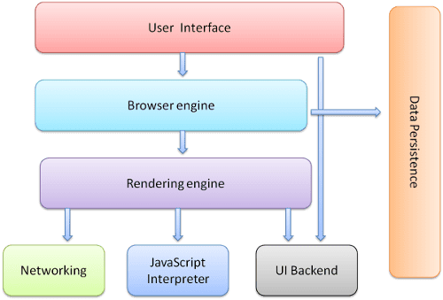 
<p align=center>Рисунок 1. Компоненты браузера</p>
</p>

<br>
<br>


Важно отметить, что такие браузеры, как Chrome, запускают несколько экземпляров механизма рендеринга: по одному для каждой вкладки. Каждая вкладка выполняется в отдельном процессе.

<br>
<br>

### Механизм рендеринга <hr>
Ответственность движка рендеринга хорошо… Рендеринг, то есть отображение запрошенного содержимого на экране браузера.

По умолчанию механизм рендеринга может отображать документы и изображения HTML и XML. Он может отображать другие типы данных через плагины или расширения; например, отображение PDF-документов с помощью подключаемого модуля просмотра PDF-файлов. Однако в этой главе мы сосредоточимся на основном варианте использования: отображении HTML и изображений, отформатированных с помощью CSS.

<br>
<br>

### Движки рендеринга <hr>
В разных браузерах используются разные механизмы рендеринга: Internet Explorer использует Trident, Firefox использует Gecko, Safari использует WebKit. Chrome и Opera (начиная с версии 15) используют Blink, ответвление WebKit.

WebKit — это механизм рендеринга с открытым исходным кодом, который начинался как движок для платформы Linux и был модифицирован Apple для поддержки Mac и Windows. Более подробную информацию можно найти на сайте webkit.org .

<br>
<br>

### Основной поток <hr>
Механизм рендеринга начнет получать содержимое запрошенного документа с сетевого уровня. Обычно это делается частями по 8 КБ.

После этого это основной поток работы движка рендеринга:

Базовый поток движка рендеринга

<br>

<p align=center>
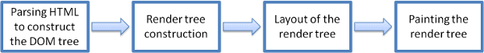 
<p align=center>Рисунок 2. Основной поток механизма рендеринга</p>
</p>

<br>
<br>

Механизм рендеринга начнет анализировать HTML-документ и преобразовывать элементы в узлы DOM в дереве, называемом «деревом контента». Движок будет анализировать данные стиля как во внешних файлах CSS, так и в элементах стиля. Информация о стиле вместе с визуальными инструкциями в HTML будет использоваться для создания другого дерева: дерева рендеринга .

Дерево рендеринга содержит прямоугольники с визуальными атрибутами, такими как цвет и размеры. Прямоугольники расположены в правильном порядке для отображения на экране.

После построения дерева рендеринга оно проходит процесс « макетирования ». Это означает предоставление каждому узлу точных координат того места, где он должен появиться на экране. Следующий этап — рисование — будет пройдено дерево рендеринга и каждый узел будет нарисован с использованием внутреннего слоя пользовательского интерфейса.

Важно понимать, что это постепенный процесс. Для лучшего взаимодействия с пользователем механизм рендеринга попытается отобразить содержимое на экране как можно скорее. Он не будет ждать, пока весь HTML будет проанализирован, прежде чем приступить к построению и компоновке дерева рендеринга. Части контента будут проанализированы и отображены, в то время как процесс продолжится с остальным контентом, который продолжает поступать из сети.

#### Примеры основного потока 
Основной поток WebKit.

<br>

<p align=center>
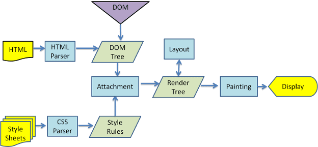 
<p align=center>Рисунок 3. Основной поток WebKit.</p>
</p>

<br>
<br>

<p align=center>
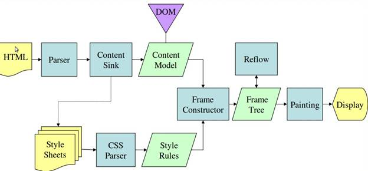 
<p align=center>Рисунок 4. Основной поток движка рендеринга Gecko от Mozilla.</p>
</p>

<br>
<br>

Из рисунков 3 и 4 видно, что хотя WebKit и Gecko используют несколько разную терминологию, последовательность действий в основном одинакова.

Gecko называет дерево визуально отформатированных элементов «деревом фреймов». Каждый элемент представляет собой рамку. WebKit использует термин «Дерево рендеринга» и состоит из «Объектов рендеринга». WebKit использует термин «макет» для размещения элементов, а Gecko называет его «перекомпоновка». «Присоединение» — это термин WebKit, обозначающий соединение узлов DOM и визуальной информации для создания дерева рендеринга. Небольшое несемантическое отличие состоит в том, что у Gecko есть дополнительный слой между HTML и деревом DOM. Он называется «приемником контента» и представляет собой фабрику по созданию элементов DOM. Мы поговорим о каждой части потока:

<br>
<br>

#### Синтаксический анализ – общий
Поскольку синтаксический анализ — очень важный процесс в движке рендеринга, мы углубимся в него. Начнем с небольшого введения в синтаксический анализ.

Анализ документа означает его преобразование в структуру, которую может использовать код. Результатом анализа обычно является дерево узлов, представляющих структуру документа. Это называется деревом разбора или синтаксическим деревом.

Например, анализ выражения `2 + 3 - 1` может вернуть такое дерево:

<br>

<p align=center>
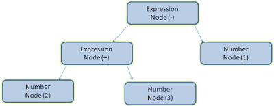 
<p align=center>Рисунок 5: узел дерева математических выражений</p>
</p>

<br>
<br>

#### Грамматика
Синтаксический анализ основан на правилах синтаксиса, которым подчиняется документ: языке или формате, в котором он был написан. Каждый формат, который вы можете анализировать, должен иметь детерминированную грамматику, состоящую из словаря и правил синтаксиса. Это называется __контекстно-свободной грамматикой__ . Человеческие языки не являются такими языками, и поэтому их нельзя анализировать с помощью традиционных методов синтаксического анализа.

#### Комбинация парсер-лексер
Синтаксический анализ можно разделить на два подпроцесса: лексический анализ и синтаксический анализ.

Лексический анализ — это процесс разбиения входных данных на токены. Токены — это словарь языка: набор действительных строительных блоков. В человеческом языке он будет состоять из всех слов, которые встречаются в словаре этого языка.

Синтаксический анализ – это применение правил синтаксиса языка.

Синтаксические анализаторы обычно делят работу между двумя компонентами: **лексером** (иногда называемым токенизатором), который отвечает за разбиение входных данных на действительные токены, и __синтаксическим анализатором__ , который отвечает за построение дерева разбора путем анализа структуры документа в соответствии с правилами синтаксиса языка.

Лексер знает, как удалить ненужные символы, такие как пробелы и разрывы строк.

<p align=center>
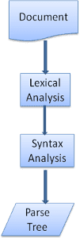 
<p align=center>Рисунок 6: от исходного документа к деревьям разбора</p>
</p>

<br>

Процесс синтаксического анализа является итеративным. Синтаксический анализатор обычно запрашивает у лексера новый токен и пытается сопоставить его с одним из правил синтаксиса. Если правило соответствует, узел, соответствующий токену, будет добавлен в дерево разбора, и синтаксический анализатор запросит другой токен.

Если ни одно правило не соответствует, синтаксический анализатор сохранит токен внутри себя и будет продолжать запрашивать токены до тех пор, пока не будет найдено правило, соответствующее всем токенам, хранящимся внутри. Если правило не найдено, синтаксический анализатор выдаст исключение. Это означает, что документ недействителен и содержит синтаксические ошибки.

<br>
<br>

#### Перевод
Во многих случаях дерево разбора не является конечным продуктом. При переводе часто используется синтаксический анализ: преобразование входного документа в другой формат. Примером является компиляция. Компилятор, который компилирует исходный код в машинный код, сначала анализирует его в дерево синтаксического анализа, а затем преобразует это дерево в документ с машинным кодом.

<p align=center>
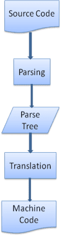 
<p align=center>Рисунок 7: процесс компиляции</p>
</p>

<br>
<br>

#### Пример парсинга
На рисунке 5 мы построили дерево разбора из математического выражения. Давайте попробуем определить простой математический язык и посмотрим на процесс анализа.

> Ключевой термин: наш язык может включать целые числа, знаки плюс и минус.

Синтаксис:

1. Строительными блоками синтаксиса языка являются выражения, термины и операции.
2. Наш язык может включать в себя любое количество выражений.
3. Выражение определяется как «термин», за которым следует «операция», за которой следует еще один термин.
4. Операция — это знак плюса или знак минуса.
5. Термин — это целочисленный токен или выражение.

Давайте проанализируем ввод ` 2 + 3 - 1 `.

Первая подстрока, соответствующая правилу, равна `2` : согласно правилу №5 это термин. Второе совпадение — `2 + 3` : это соответствует третьему правилу: за термином следует операция, за которой следует еще один термин. Следующее совпадение будет найдено только в конце ввода. `2 + 3 - 1` — это выражение, поскольку мы уже знаем, что `2 + 3` — это терм, поэтому у нас есть терм, за которым следует операция, за которой следует еще один терм. `2 + +` не будет соответствовать ни одному правилу и, следовательно, является недопустимым вводом.

<br>

#### Формальные определения словарного запаса и синтаксиса
Словарный запас обычно выражается регулярными выражениями .

Например, наш язык будет определен как:

```SQL
INTEGER: 0|[1-9][0-9]*
PLUS: +
MINUS: -
```

Как видите, целые числа определяются регулярным выражением.

Синтаксис обычно определяется в формате BNF . Наш язык будет определен как:

```SQL
expression :=  term  operation  term
operation :=  PLUS | MINUS
term := INTEGER | expression
```

Мы сказали, что язык может быть разобран обычными парсерами, если его грамматика является контекстно-свободной. Интуитивное определение контекстно-свободной грамматики — это грамматика, которая может быть полностью выражена в BNF. Формальное определение см. в статье [Википедии «Контекстно-свободная грамматика»](https://en.wikipedia.org/wiki/Context-free_grammar).

<br>
<br>

#### Типы парсеров
Существует два типа парсеров: анализаторы сверху вниз и анализаторы снизу вверх. Интуитивное объяснение состоит в том, что анализаторы сверху вниз исследуют структуру синтаксиса высокого уровня и пытаются найти соответствие правилу. Анализаторы снизу вверх начинают с входных данных и постепенно преобразуют их в правила синтаксиса, начиная с правил низкого уровня до тех пор, пока не будут соблюдены правила высокого уровня.

Давайте посмотрим, как два типа парсеров будут анализировать наш пример.

Анализатор сверху вниз начнет с правила более высокого уровня: он определит `2 + 3` как выражение. Затем он идентифицирует `2 + 3 - 1` как выражение (процесс идентификации выражения развивается в соответствии с другими правилами, но отправной точкой является правило самого высокого уровня).

Синтаксический анализатор снизу вверх будет сканировать входные данные до тех пор, пока не будет найдено соответствие правилу. Затем он заменит соответствующий ввод правилом. Это будет продолжаться до конца ввода. Частично совпавшее выражение помещается в стек синтаксического анализатора.

|         Куча      |     Вход    |
|-------------------|:------------|
|                   |  2 + 3 - 1  |
|срок               |   + 3 - 1   |
|срок эксплуатации  |	 3 – 1    |
|выражение          |     - 1     |
|операция выражения	|      1      |
|выражение          |      -      |

Этот тип синтаксического анализатора снизу вверх называется анализатором сдвига-сокращения, поскольку ввод смещается вправо (представьте себе указатель, указывающий сначала на начало ввода и перемещающийся вправо) и постепенно сводится к синтаксическим правилам.

<br>
<br>

#### Автоматическое создание парсеров
Есть инструменты, которые могут генерировать парсер. Вы передаете им грамматику вашего языка — его словарный запас и правила синтаксиса — и они создают работающий парсер. Создание парсера требует глубокого понимания синтаксического анализа, а создать оптимизированный парсер вручную нелегко, поэтому генераторы парсеров могут быть очень полезны.

WebKit использует два хорошо известных генератора парсеров: [Flex](https://en.wikipedia.org/wiki/Flex_(lexical_analyser_generator)) для создания лексера и [Bison](https://www.gnu.org/software/bison/) для создания парсера (вы можете столкнуться с ними под именами Lex и Yacc). Входные данные Flex — это файл, содержащий определения токенов регулярными выражениями. Входные данные Bison — это правила синтаксиса языка в формате BNF.

<br>
<br>

#### HTML-парсер <hr>
Задача анализатора HTML — преобразовать разметку HTML в дерево разбора.

Определение грамматики HTML
Словарь и синтаксис HTML определены в спецификациях, созданных организацией W3C.

<br>

##### Не контекстно-свободная грамматика
Как мы видели во введении в синтаксический анализ, синтаксис грамматики может быть формально определен с использованием таких форматов, как BNF.

К сожалению, все традиционные темы парсера не применимы к HTML (я поднял их не просто для развлечения — они будут использоваться при анализе CSS и JavaScript). HTML не может быть легко определен с помощью контекстно-свободной грамматики, которая необходима синтаксическим анализаторам.

Существует формальный формат определения HTML — DTD (Определение типа документа), но он не является контекстно-свободной грамматикой.

На первый взгляд это кажется странным; HTML довольно близок к XML. Существует множество доступных парсеров XML. Существует XML-вариант HTML — XHTML — так в чем же большая разница?

Разница в том, что подход HTML более «снисходителен»: он позволяет опускать определенные теги (которые затем добавляются неявно), а иногда и опускать начальные или конечные теги и т. д. В целом это «мягкий» синтаксис, в отличие от жесткого и требовательного синтаксиса XML.

Эта, казалось бы, маленькая деталь имеет огромное значение. С одной стороны, это основная причина популярности HTML: он прощает ваши ошибки и облегчает жизнь веб-автору. С другой стороны, это затрудняет написание формальной грамматики. Подводя итог, можно сказать, что HTML не может быть легко разобран обычными анализаторами, поскольку его грамматика не является контекстно-свободной. HTML не может быть проанализирован парсерами XML.

<br>

##### HTML-ОТД
Определение HTML находится в формате DTD. Этот формат используется для определения языков семейства SGML . Формат содержит определения всех разрешенных элементов, их атрибутов и иерархии. Как мы видели ранее, HTML DTD не формирует контекстно-свободную грамматику.

Существует несколько вариантов DTD. Строгий режим соответствует исключительно спецификациям, но другие режимы поддерживают разметку, использовавшуюся браузерами в прошлом. Целью является обратная совместимость со старым контентом. Текущий строгий DTD находится здесь: www.w3.org/TR/html4/strict.dtd .

<br>

##### ДОМ
Выходное дерево («дерево синтаксического анализа») представляет собой дерево элементов DOM и узлов атрибутов. DOM — это сокращение от объектной модели документа. Это объектное представление HTML-документа и интерфейс HTML-элементов с внешним миром, например JavaScript.

Корнем дерева является объект « Документ ».

DOM имеет почти однозначное отношение к разметке. Например:

```HTML
<html>
  <body>
    <p>
      Hello World
    </p>
    <div> </div>
  </body>
</html>
```
<br>

Эта разметка будет преобразована в следующее дерево DOM:

<p align=center>
    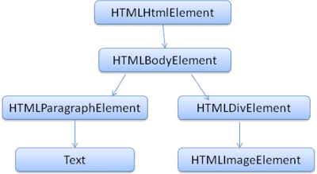
    <p  align=center>
        Рисунок 8: Дерево DOM примера разметки.
    </p>
</p>

Дерево DOM примера разметки


Как и HTML, DOM определяется организацией W3C. См. www.w3.org/DOM/DOMTR . Это общая спецификация для работы с документами. Конкретный модуль описывает определенные элементы HTML. Определения HTML можно найти здесь: www.w3.org/TR/2003/REC-DOM-Level-2-HTML-20030109/idl-definitions.html .

Когда я говорю, что дерево содержит узлы DOM, я имею в виду, что дерево состоит из элементов, реализующих один из интерфейсов DOM. Браузеры используют конкретные реализации, у которых есть другие атрибуты, используемые браузером внутри.

<br>

##### Алгоритм парсинга
Как мы видели в предыдущих разделах, HTML нельзя анализировать с помощью обычных парсеров «сверху вниз» или «снизу вверх».

Причины:

1. Прощающая природа языка.

2. Тот факт, что браузеры имеют традиционную устойчивость к ошибкам для поддержки хорошо известных случаев недопустимого HTML.
3. Процесс синтаксического анализа является реентерабельным. Для других языков источник не меняется во время синтаксического анализа, но в HTML динамический код (например, элементы сценария, содержащие вызовы `document.write()` ) может добавлять дополнительные токены, поэтому процесс синтаксического анализа фактически изменяет входные данные.

Не имея возможности использовать обычные методы анализа, браузеры создают собственные анализаторы для анализа HTML.

[Алгоритм парсинга подробно описан спецификацией HTML5](https://html.spec.whatwg.org/multipage/parsing.html) . Алгоритм состоит из двух этапов: токенизации и построения дерева.

Токенизация — это лексический анализ, разбивающий входные данные на токены. К токенам HTML относятся начальные теги, конечные теги, имена атрибутов и значения атрибутов.

Токенизатор распознает токен, передает его конструктору дерева и использует следующий символ для распознавания следующего токена и так далее до конца ввода.

Порядок анализа HTML (взято из спецификации HTML5)
<p align=center>
    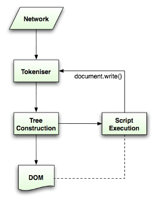
    <p  align=center>
        Рисунок 9. Порядок анализа HTML (взято из спецификации HTML5).
    </p>
</p>

<br>
<br>

##### Алгоритм токенизации
Результатом работы алгоритма является HTML-токен. Алгоритм выражается в виде конечного автомата. Каждое состояние потребляет один или несколько символов входного потока и обновляет следующее состояние в соответствии с этими символами. На решение влияет текущее состояние токенизации и состояние построения дерева. Это означает, что один и тот же использованный символ будет давать разные результаты для правильного следующего состояния, в зависимости от текущего состояния. Алгоритм слишком сложен, чтобы его можно было полностью описать, поэтому давайте рассмотрим простой пример, который поможет нам понять принцип.

Базовый пример — токенизация следующего HTML:

```HTML
<html>
  <body>
    Hello world
  </body>
</html>
```

Исходное состояние — «Состояние данных». При обнаружении символа `<` состояние меняется на __«Состояние тега открытое»__ . Использование символа `az` приводит к созданию «токена начального тега», состояние которого меняется на __«состояние имени тега»__ . Мы остаемся в этом состоянии до тех пор, пока не будет использован символ `>` . Каждый символ добавляется к новому имени токена. В нашем случае созданный токен представляет собой `html` токен.

При достижении тега `>` генерируется текущий токен, и состояние меняется обратно на __«Состояние данных»__ . Тег `<body>` будет обрабатываться теми же действиями. На данный момент теги `html` и `body` были созданы. Теперь мы вернулись в __«Состояние данных»__ . Использование символа `H` `Hello world` приведет к созданию и выдаче символьного токена, это продолжается до тех пор, пока не будет достигнут `<` of `</body>` . Мы создадим токен персонажа для каждого персонажа `Hello world` .

Теперь мы вернулись в __«состояние открытого тега»__. Использование следующего ввода `/` приведет к созданию `end tag token` и переходу в __«состояние имени тега»__ . Мы снова остаемся в этом состоянии, пока не достигнем `>` . Затем будет выпущен новый токен тега, и мы вернемся в __«Состояние данных»__ . Ввод `</html>` будет обрабатываться так же, как и в предыдущем случае.


<p align=center>
    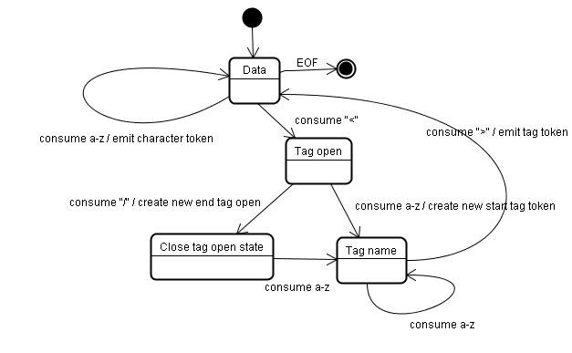
    <p  align=center>
        Рисунок 10: Токенизация входных данных примера
    </p>
</p>

<br>
<br>

##### Алгоритм построения дерева
При создании парсера создается объект Document. На этапе построения дерева дерево DOM с Документом в корне будет изменено и к нему будут добавлены элементы. Каждый узел, созданный токенизатором, будет обработан конструктором дерева. Для каждого токена спецификация определяет, какой элемент DOM имеет к нему отношение и будет создан для этого токена. Элемент добавляется в дерево DOM, а также в стек открытых элементов. Этот стек используется для исправления несоответствий вложенности и незакрытых тегов. Алгоритм также описывается как конечный автомат. Состояния называются «режимами вставки».

Давайте посмотрим на процесс построения дерева для примера входных данных:

```HTML
<html>
  <body>
    Hello world
  </body>
</html>
```

Входными данными для этапа построения дерева является последовательность токенов с этапа токенизации. Первый режим — __«начальный режим»__ . Получение токена _«html»_ приведет к переходу в режим __«до HTML»__ и повторной обработке токена в этом режиме. Это приведет к созданию элемента HTMLHtmlElement, который будет добавлен к корневому объекту Document.

Состояние будет изменено на __«до головы»__ . Затем принимается токен «тело». HTMLHeadElement будет создан неявно, хотя у нас нет токена «head», и он будет добавлен в дерево.

Теперь мы переходим в режим __«в голове»__ , а затем в __режим «после головы»__ . Токен тела повторно обрабатывается, создается и вставляется HTMLBodyElement, а режим переводится в __«в теле»__ .

Маркеры символов строки «Hello world» теперь получены. Первый вызовет создание и вставку узла «Текст», а остальные символы будут добавлены к этому узлу.

Получение токена завершения тела приведет к переходу в режим __«после тела»__ . Теперь мы получим закрывающий тег html, который переведет нас в режим __«после после тела»__ . Получение токена конца файла завершит синтаксический анализ.

<br>

<p align=center>
    
    <p  align=center>
        Рисунок 11: древовидное построение примера HTML.
    </p>
</p>

<br>
<br>

##### Действия после завершения разбора
На этом этапе браузер пометит документ как интерактивный и начнет анализировать скрипты, находящиеся в «отложенном» режиме: те, которые должны быть выполнены после анализа документа. Состояние документа будет установлено на «завершено», и будет запущено событие «загрузка».

Полные алгоритмы токенизации и построения деревьев вы можете увидеть в спецификации HTML5 .

Устойчивость браузеров к ошибкам
Вы никогда не получите ошибку «Неверный синтаксис» на HTML-странице. Браузеры исправляют любой недопустимый контент и продолжают работу.

Возьмем, к примеру, этот HTML:

```HTML
<html>
  <mytag>
  </mytag>
  <div>
  <p>
  </div>
    Really lousy HTML
  </p>
</html>
```

Должно быть, я нарушил около миллиона правил («mytag» не является стандартным тегом, неправильная вложенность элементов «p» и «div» и многое другое), но браузер все равно показывает это правильно и не жалуется. Таким образом, большая часть кода парсера исправляет ошибки автора HTML.

Обработка ошибок в браузерах вполне единообразна, но, что удивительно, она не была частью спецификаций HTML. Подобно закладкам и кнопкам «Назад/Вперед», это просто то, что развивалось в браузерах на протяжении многих лет. Известны недопустимые конструкции HTML, повторяющиеся на многих сайтах, и браузеры пытаются исправить их способом, соответствующим другим браузерам.

Спецификация HTML5 определяет некоторые из этих требований. (WebKit прекрасно резюмирует это в комментарии в начале класса анализатора HTML.)

Анализатор анализирует токенизированные входные данные в документ, создавая дерево документа. Если документ правильно сформирован, его анализ не вызывает затруднений.

К сожалению, нам приходится обрабатывать множество HTML-документов, которые имеют неправильный формат, поэтому синтаксический анализатор должен быть терпим к ошибкам.

Мы должны позаботиться как минимум о следующих ошибках:

1. Добавляемый элемент явно запрещен внутри некоторого внешнего тега. В этом случае нам следует закрыть все теги до того, который запрещает элемент, и добавить его позже.
2. Нам не разрешено добавлять элемент напрямую. Возможно, человек, написавший документ, забыл какой-то тег между ними (или тег между ними не является обязательным). Это может произойти со следующими тегами: HTML HEAD BODY TBODY TR TD LI (я забыл какой-нибудь?).
3. Мы хотим добавить блочный элемент внутри строчного элемента. Закройте все встроенные элементы до следующего более высокого элемента блока.
4. Если это не помогает, закройте элементы, пока нам не будет разрешено добавить элемент, или игнорируйте тег.

Давайте посмотрим несколько примеров устойчивости к ошибкам WebKit:

__`</br>` вместо `<br>`__

Некоторые сайты используют `</br>` вместо `<br>` . Чтобы быть совместимым с IE и Firefox, WebKit обрабатывает это как `<br>` .

Код:

```javascript
if (t->isCloseTag(brTag) && m_document->inCompatMode()) {
     reportError(MalformedBRError);
     t->beginTag = true;
}
```
Обратите внимание, что обработка ошибок является внутренней: она не будет представлена ​​пользователю.

<br>

##### Бродячий стол
Случайная таблица — это таблица внутри другой таблицы, но не внутри ячейки таблицы.

Например:

```HTML
<table>
  <table>
    <tr><td>inner table</td></tr>
  </table>
  <tr><td>outer table</td></tr>
</table>
```
WebKit изменит иерархию на две одноуровневые таблицы:

```HTML
<table>
  <tr><td>outer table</td></tr>
</table>
<table>
  <tr><td>inner table</td></tr>
</table>
```
Код:

```javascript
if (m_inStrayTableContent && localName == tableTag)
        popBlock(tableTag);
```
WebKit использует стек для текущего содержимого элемента: он извлекает внутреннюю таблицу из стека внешней таблицы. Таблицы теперь будут одноуровневыми.

<br>

##### Вложенные элементы формы
Если пользователь помещает форму в другую форму, вторая форма игнорируется.

Код:

```javascript
if (!m_currentFormElement) {
        m_currentFormElement = new HTMLFormElement(formTag,    m_document);
}
```
Слишком глубокая иерархия тегов
Комментарий говорит сам за себя.

> Примечание. www.liceo.edu.mx — это пример сайта, уровень вложенности которого составляет около 1500 тегов, все из группы \<b> . Мы разрешаем не более 20 вложенных тегов одного типа, а затем просто игнорируем их все вместе.

```javascript
bool HTMLParser::allowNestedRedundantTag(const AtomicString& tagName)
{

unsigned i = 0;
for (HTMLStackElem* curr = m_blockStack;
         i < cMaxRedundantTagDepth && curr && curr->tagName == tagName;
     curr = curr->next, i++) { }
return i != cMaxRedundantTagDepth;
}
```
__Неправильно размещены конечные теги HTML или тела.__

Опять же - комментарий говорит сам за себя.

> Примечание. Поддержка действительно сломанного HTML. Мы никогда не закрываем тег body, поскольку некоторые глупые веб-страницы закрывают его до фактического конца документа. Давайте воспользуемся вызовом end() для закрытия.
```javascript
if (t->tagName == htmlTag || t->tagName == bodyTag )
        return;
```

Поэтому веб-авторы будьте осторожны - если вы не хотите, чтобы они использовались в качестве примера во фрагменте кода устойчивости к ошибкам WebKit, - пишите правильно сформированный HTML.

<br>
<br>

#### CSS-парсинг
Помните концепции синтаксического анализа во введении? В отличие от HTML, CSS является контекстно-свободной грамматикой и может анализироваться с использованием типов парсеров, описанных во введении. Фактически [спецификация CSS определяет лексическую и синтаксическую грамматику CSS](https://www.w3.org/TR/CSS2/grammar.html) .

Давайте посмотрим несколько примеров:

Лексическая грамматика (словарь) определяется регулярными выражениями для каждого токена:

```CSS
comment   \/\*[^*]*\*+([^/*][^*]*\*+)*\/
num       [0-9]+|[0-9]*"."[0-9]+
nonascii  [\200-\377]
nmstart   [_a-z]|{nonascii}|{escape}
nmchar    [_a-z0-9-]|{nonascii}|{escape}
name      {nmchar}+
ident     {nmstart}{nmchar}*
```
«ident» — это сокращение от идентификатора, например, имени класса. «имя» — это идентификатор элемента (на который указывает «#»)

Синтаксическая грамматика описана в BNF.

```bnf
ruleset
  : selector [ ',' S* selector ]*
    '{' S* declaration [ ';' S* declaration ]* '}' S*
  ;
selector
  : simple_selector [ combinator selector | S+ [ combinator? selector ]? ]?
  ;
simple_selector
  : element_name [ HASH | class | attrib | pseudo ]*
  | [ HASH | class | attrib | pseudo ]+
  ;
class
  : '.' IDENT
  ;
element_name
  : IDENT | '*'
  ;
attrib
  : '[' S* IDENT S* [ [ '=' | INCLUDES | DASHMATCH ] S*
    [ IDENT | STRING ] S* ] ']'
  ;
pseudo
  : ':' [ IDENT | FUNCTION S* [IDENT S*] ')' ]
  ;
```
Объяснение:

Набор правил — это такая структура:

```css
div.error, a.error {
  color:red;
  font-weight:bold;
}
```
`div.error` и `a.error` являются селекторами. Часть внутри фигурных скобок содержит правила, применяемые этим набором правил. Эта структура формально определена в следующем определении:

```bnf
ruleset
  : selector [ ',' S* selector ]*
    '{' S* declaration [ ';' S* declaration ]* '}' S*
  ;
```

Это означает, что набор правил представляет собой селектор или, возможно, несколько селекторов, разделенных запятой и пробелами (S означает пробел). Набор правил содержит фигурные скобки, а внутри них объявление или, при необходимости, несколько объявлений, разделенных точкой с запятой. «объявление» и «селектор» будут определены в следующих определениях BNF.

<br>
<br>

##### CSS-парсер WebKit
WebKit использует генераторы анализаторов Flex и Bison для автоматического создания анализаторов из файлов грамматики CSS. Как вы помните из введения в парсер, Bison создает синтаксический анализатор сдвига и сокращения снизу вверх. Firefox использует парсер сверху вниз, написанный вручную. В обоих случаях каждый файл CSS анализируется в объект StyleSheet. Каждый объект содержит правила CSS. Объекты правил CSS содержат объекты селектора и объявления, а также другие объекты, соответствующие грамматике CSS.

<br>

<p align=center>
    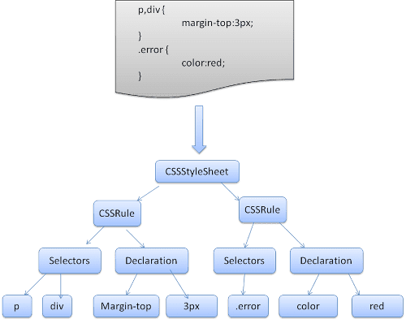
    <p  align=center>
       Рисунок 12: синтаксический анализ CSS
    </p>
</p>

<br>
<br>

#### Порядок обработки скриптов и таблиц стилей <hr>
##### Скрипты
Модель сети синхронна. Авторы ожидают, что скрипты будут анализироваться и выполняться немедленно, когда парсер достигнет тега `<script>` . Анализ документа останавливается до тех пор, пока скрипт не будет выполнен. Если скрипт является внешним, то ресурс сначала необходимо получить из сети — это также делается синхронно, и синтаксический анализ останавливается до тех пор, пока ресурс не будет получен. Эта модель использовалась на протяжении многих лет и также указана в спецификациях HTML4 и 5. Авторы могут добавить в скрипт атрибут «defer», и в этом случае он не остановит синтаксический анализ документа и будет выполнен после анализа документа. В HTML5 добавлена ​​возможность пометить сценарий как асинхронный, чтобы он анализировался и выполнялся в другом потоке.`

##### Спекулятивный анализ
И WebKit, и Firefox выполняют такую ​​оптимизацию. Во время выполнения скриптов другой поток анализирует остальную часть документа, выясняет, какие еще ресурсы необходимо загрузить из сети, и загружает их. Таким образом, ресурсы можно загружать в параллельные соединения, а общая скорость повышается. Примечание. Спекулятивный парсер анализирует только ссылки на внешние ресурсы, такие как внешние скрипты, таблицы стилей и изображения: он не изменяет дерево DOM — это остается на усмотрение основного парсера.

##### Таблицы стилей
С другой стороны, таблицы стилей имеют другую модель. Концептуально кажется, что, поскольку таблицы стилей не меняют дерево DOM, нет смысла ждать их и останавливать анализ документа. Однако существует проблема со сценариями, запрашивающими информацию о стиле на этапе анализа документа. Если стиль еще не загружен и не проанализирован, скрипт будет получать неверные ответы, и, видимо, это вызывает множество проблем. Кажется, это крайний случай, но он довольно распространен. Firefox блокирует все скрипты, если таблица стилей все еще загружается и анализируется. WebKit блокирует сценарии только тогда, когда они пытаются получить доступ к определенным свойствам стиля, на которые могут повлиять выгруженные таблицы стилей.

##### Построение дерева рендеринга <hr>
Пока строится дерево DOM, браузер создает другое дерево — дерево рендеринга. Это дерево состоит из визуальных элементов в том порядке, в котором они будут отображаться. Это визуальное представление документа. Назначение этого дерева — обеспечить возможность раскрашивания содержимого в правильном порядке.

Firefox называет элементы дерева рендеринга «фреймами». WebKit использует термин средство рендеринга или объект рендеринга.

Средство визуализации знает, как расположить и нарисовать себя и свои дочерние элементы.

Класс WebKit RenderObject, базовый класс средств рендеринга, имеет следующее определение:

```javascript
class RenderObject{
  virtual void layout();
  virtual void paint(PaintInfo);
  virtual void rect repaintRect();
  Node* node;  //the DOM node
  RenderStyle* style;  // the computed style
  RenderLayer* containgLayer; //the containing z-index layer
}
```
Каждый рендерер представляет собой прямоугольную область, обычно соответствующую блоку CSS узла, как описано в спецификации CSS2. Он включает в себя геометрическую информацию, такую ​​как ширина, высота и положение.

На тип блока влияет значение «display» атрибута стиля, соответствующего узлу (см. раздел «Вычисление стиля »). Вот код WebKit для принятия решения о том, какой тип средства визуализации следует создать для узла DOM в соответствии с атрибутом display:

```javascript
RenderObject* RenderObject::createObject(Node* node, RenderStyle* style)
{
    Document* doc = node->document();
    RenderArena* arena = doc->renderArena();
    ...
    RenderObject* o = 0;

    switch (style->display()) {
        case NONE:
            break;
        case INLINE:
            o = new (arena) RenderInline(node);
            break;
        case BLOCK:
            o = new (arena) RenderBlock(node);
            break;
        case INLINE_BLOCK:
            o = new (arena) RenderBlock(node);
            break;
        case LIST_ITEM:
            o = new (arena) RenderListItem(node);
            break;
       ...
    }

    return o;
}
```
Также учитывается тип элемента: например, элементы управления формами и таблицы имеют специальные рамки.

В WebKit, если элемент хочет создать специальный рендерер, он переопределит метод `createRenderer()` . Средства визуализации указывают на объекты стиля, содержащие негеометрическую информацию.

##### Связь дерева рендеринга с деревом DOM
Средства визуализации соответствуют элементам DOM, но отношение не является один к одному. Несоответные элементы DOM не будут вставлены в дерево рендеринга. Примером является элемент "головы". Также элементы, чье значение отображения было назначено «нет», не появятся на дереве (тогда как на дереве появятся элементы с «скрытой» видимостью).

Есть элементы DOM, которые соответствуют нескольким визуальным объектам. Обычно это элементы со сложной структурой, которые не могут быть описаны одним прямоугольником. Например, элемент «Select» имеет три визуализатора: один для области отображения, один для раскрывающегося списка и один для кнопки. Кроме того, когда текст разбит на несколько строк, потому что ширина недостаточно для одной строки, новые линии будут добавлены в качестве дополнительных визуализаций.

Другим примером множественных рендеристов является разбитый HTML. Согласно спецификации CSS, встроенный элемент должен содержать либо блокировать только элементы, либо только встроенные элементы. В случае смешанного контента будут созданы анонимные визуализаторы блоков, чтобы обернуть встроенные элементы.

Некоторые рендеринг -объекты соответствуют узлу DOM, но не в том же месте в дереве. Поплавки и абсолютно позиционированные элементы вышли из потока, помещаются в другую часть дерева и нанесены на карту на реальную кадр. Рамка для заполнителей - это то, где они должны были быть.

<br>

<p align=center>
    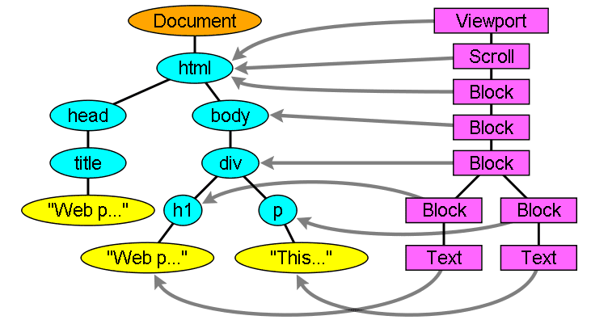
    <p  align=center>
       Рисунок 13: Дерево рендеринга и соответствующее дерево DOM. «Viewport» - это начальный блок. В Webkit это будет объект "renderview"
    </p>
</p>

<br>
<br>


##### Поток построения дерева
В Firefox презентация зарегистрирована как слушатель для обновлений DOM. Представление делегатов создает создание для `FrameConstructor` , а конструктор разрешает стиль (см. Вычисление стиля ) и создает кадр.

В Webkit процесс разрешения стиля и создания рендеринга называется «привязанностью». Каждый узел DOM имеет метод «прикрепления». Приложение является синхронным, вставка узла к дереву DOM вызывает новый метод «Прикрепления».

Обработка HTML и тегов тела приводит к созданию корня рендеринга. Объект render Render соответствует тому, что спецификация CSS вызывает содержащий блок: самый верхний блок, который содержит все остальные блоки. Его размеры - порт Viewport: размеры области отображения окна браузера. Firefox называет его `ViewPortFrame` , а Webkit называет его `RenderView` . Это объект рендеринга, на который указывает документ. Остальная часть дерева построена как вставка узлов DOM.

Смотрите [спецификацию CSS2 на модели обработки](https://www.w3.org/TR/CSS21/intro.html#processing-model) .

##### Вычисление стиля
Создание дерева рендеринга требует расчета визуальных свойств каждого объекта рендеринга. Это делается путем расчета свойств стиля каждого элемента.

Стиль включает в себя листы стиля различных истоков, элементы встроенного стиля и визуальные свойства в HTML (например, свойство «BGColor»). Позднее переводится на соответствующие свойства стиля CSS.

Происхождение листов в стиле - это листы в стиле по умолчанию браузера, листы стиля, предоставленные автором страницы и листами в стиле пользователя - это листы стилей, предоставленные пользователем браузера (браузеры позволяют вам определить ваши любимые стили. В Firefox, например, это выполнено путем размещения листа стиля в папку «Firefox Profile»).

Вычисление в стиле вызывает несколько трудностей:

1. Данные стиля - очень большая конструкция, удерживая многочисленные свойства стиля, это может вызвать проблемы с памятью.
2. Поиск правил соответствия для каждого элемента может вызвать проблемы с производительностью, если они не оптимизированы. Переход всего списка правил для каждого элемента найти совпадения - это тяжелая задача. Селекторы могут иметь сложную структуру, которая может привести к тому, что процесс сопоставления начинается с, казалось бы, многообещающего пути, который оказался бесполезным, а другой путь должен быть опробован.
Например - этот комплексный селектор:
`
div div div div{
...
}
`
Означает, что правила применяются к `<div>` , кто является потомком 3 Div. Предположим, вы хотите проверить, применяется ли правило для данного элемента `<div>` . Вы выбираете определенный путь вверх по дереву для проверки. Возможно, вам придется пройти через узловое дерево, чтобы узнать, что есть только два DIV, и правило не применяется. Затем вам нужно попробовать другие пути на дереве.

3. Применение правил включает в себя довольно сложные каскадные правила, которые определяют иерархию правил.

Посмотрим, как браузеры сталкиваются с этими проблемами:

<br>

#### Данные об обмене стиля
Узлы WebKit ссылки на стиль объектов (renderStyle). Эти объекты могут быть разделены узлами в некоторых условиях. Узлы - братья и сестры или двоюродные братья и:

1. Элементы должны быть в одном и том же состоянии мыши (например, один не может быть в: парить, а другой - нет)
2. Ни один элемент не должен иметь удостоверения личности
3. Имена тегов должны соответствовать
4. Атрибуты класса должны соответствовать
5. Набор картированных атрибутов должен быть идентичным
6. Состояния ссылки должны соответствовать
7. Состояния фокуса должны соответствовать
8. Ни на ни один элемент не должен зависеть от селекторов атрибутов, где затронуто определяется как какое -либо соответствие селектора, которое использует селектор атрибутов в любой позиции в селекторе вообще
9. Не должно быть атрибута встроенного стиля на элементах
10. Не должно быть никаких сестер, используемых вообще. Webcore просто бросает глобальный коммутатор, когда встречается любой селектор братьев и сестер, и отключает обмен стилем для всего документа, когда они присутствуют. Это включает в себя селектор + и селекторы, такие как: первый ребенок и: последний ребенок.

<br>

#### Firefox Rule Tree
У Firefox есть два дополнительных деревья для более легкого вычисления в стиле: дерево правил и контекстное дерево стиля. У Webkit также есть стильные объекты, но они не хранятся в дереве, подобном контекстному дереву стиля, только узел DOM указывает на его соответствующий стиль.

<br>

<p align=center>
    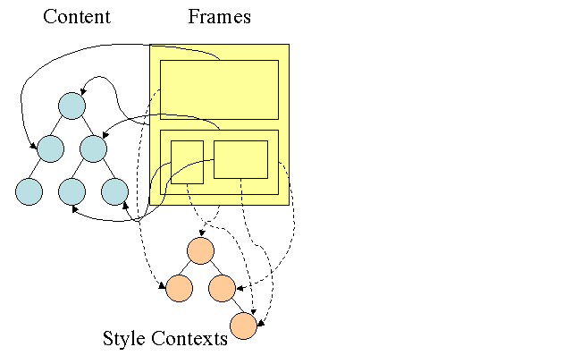
    <p  align=center>
       Рисунок 14: Контекстное дерево стиля Firefox.
    </p>
</p>

<br>
<br>

Контексты в стиле содержат конечные значения. Значения вычисляются путем применения всех правил сопоставления в правильном порядке и выполнения манипуляций, которые преобразуют их из логических в конкретные значения. Например, если логическое значение составляет процент от экрана, оно будет рассчитано и преобразовано в абсолютные единицы. Идея дерева правил действительно умна. Это позволяет делиться этими значениями между узлами, чтобы не вычислять их снова. Это также экономит пространство.

Все соответствующие правила хранятся в дереве. Нижние узлы на пути имеют более высокий приоритет. Дерево содержит все пути для совпадений правил, которые были найдены. Хранение правил сделано лениво. Дерево не рассчитывается в начале для каждого узла, но всякий раз, когда необходимо вычислять стиль узла, вычисленные пути добавляются в дерево.

Идея состоит в том, чтобы увидеть пути деревьев как слова в лексиконе. Допустим, мы уже вычислили это дерево правил:

<br>

<p align=center>
    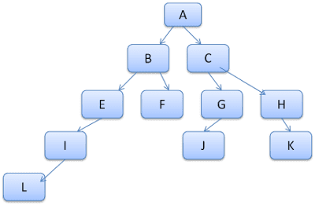
    <p  align=center>
       Рисунок 15: Вычисленное дерево правил.
    </p>
</p>

<br>
<br>

Предположим, нам нужно соответствовать правилам для другого элемента в дереве содержания и выяснить, что соответствующие правила (в правильном порядке) являются BEI. У нас уже есть этот путь на дереве, потому что мы уже рассчитали путь, Абейл. Теперь у нас будет меньше работы.

Посмотрим, как дерево спасает нас работать.

<br>

#### Разделение на структуры
Контексты стиля разделены на структуры. Эти структуры содержат информацию о стиле для определенной категории, такой как граница или цвет. Все свойства в структуре либо унаследованы, либо унаследованы. Унаследованные свойства - это свойства, которые, если они не определены элементом, унаследованы от его родителя. Неконтролируемые свойства (называемые «сброшенными» свойствами) используют значения по умолчанию, если не определены.

Дерево помогает нам, кэшируя целые структуры (содержащие вычисленные конечные значения) в дереве. Идея состоит в том, что если нижний узел не предоставил определение для структуры, можно использовать кэшированную структуру в верхнем узле.


#### Вычисление контекстов стиля с использованием дерева правил
При вычислении контекста стиля для определенного элемента мы сначала вычисляем путь в дереве правил или используем существующий. Затем мы начинаем применять правила на пути, чтобы заполнить структуры в нашем контексте нашего нового стиля. Мы начинаем с нижнего узла пути - тот, который с самым высоким приоритетом (обычно самый специфический селектор) и перемещать дерево вверх до тех пор, пока наша структура не будет заполнена. Если в этом узле правила нет спецификации, то мы можем значительно оптимизировать - мы поднимаемся на дерево, пока не найдем узел, который полностью его указывает и просто указывают на него - это наилучшая оптимизация - вся структура используется. Это сохраняет вычисление конечных значений и памяти.

Если мы найдем частичные определения, мы поднимаемся по дереву, пока структура не будет заполнена.

Если мы не нашли никаких определений для нашей структуры, то в случае, если структура является «унаследованным» типом, мы указываем на структуру нашего родителя в __дереве контекста__ . В этом случае нам также удалось разделить структуры. Если это структура сброса, то будут использоваться значения по умолчанию.

Если наиболее конкретный узел действительно добавляет значения, то нам нужно сделать дополнительные вычисления для преобразования его в реальных значениях. Затем мы кэшируем результат в узле дерева, чтобы его можно было использовать детьми.

В случае, если у элемента есть брат или брат, который указывает на тот же узел дерева, тогда между ними можно разделить __весь контекст стиля__ .

Давайте посмотрим на пример: предположим, что у нас есть этот HTML

```html
<html>
  <body>
    <div class="err" id="div1">
      <p>
        this is a <span class="big"> big error </span>
        this is also a
        <span class="big"> very  big  error</span> error
      </p>
    </div>
    <div class="err" id="div2">another error</div>
  </body>
</html>
```
И следующие правила:

```css
div {margin: 5px; color:black}
.err {color:red}
.big {margin-top:3px}
div span {margin-bottom:4px}
#div1 {color:blue}
#div2 {color:green}
```

Чтобы упростить вещи, скажем, нам нужно заполнить только две структуры: цветовая структура и маржинальная структура. Цветовая конструкция содержит только один элемент: цвет, который маржинальный конструкция содержит четыре стороны.

Полученное дерево правил будет выглядеть так (узлы отмечены именем узла: количество правила, на которое они указывают):

<p align=center>
    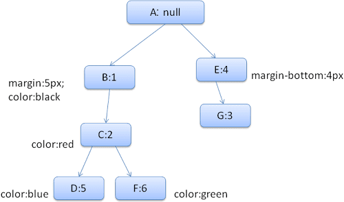
    <p  align=center>
       Рисунок 16: Дерево правил
    </p>
</p>

<br>
<br>

Дерево контекста будет выглядеть так (имя узла: Узел правила, на который они указывают):

<p align=center>
    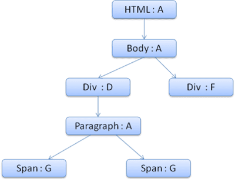
    <p  align=center>
       Рисунок 17: Дерево контекста
    </p>
</p>

<br>
<br>

Предположим, мы проанализируем HTML и добираемся до второго тега `<div>`. Нам нужно создать контекст стиля для этого узла и заполнить его стильные структуры.

Мы сопоставляем правила и обнаружим, что правила сопоставления для `<div>` - 1, 2 и 6. Это означает, что в дереве уже существует существующий путь, который может использовать наш элемент, и нам просто нужно добавить еще один узел для него для Правило 6 (узел F в дереве правил).

Мы создадим контекст стиля и поместим его в контекстное дерево. Контекст нового стиля будет указывать на узел F в дереве правил.

Теперь нам нужно заполнить стильные структуры. Мы начнем с заполнения маржинальной структуры. Поскольку последний узел правила (F) не добавляет к маржинальной структуре, мы можем подняться на дерево, пока не найдем кэшированную структуру, рассчитанную в предыдущей вставке узла, и использовать его. Мы найдем его на узле B, который является самым верхним узлом, который указал правила маржи.

У нас есть определение для цветной структуры, поэтому мы не можем использовать кэшированную структуру. Поскольку в цвете есть один атрибут, нам не нужно подниматься по дереву, чтобы заполнить другие атрибуты. Мы рассмотрим конечное значение (преобразовать строку в RGB и т. Д.) и кэшируйте вычисленную структуру в этом узле.

Работа над вторым элементом `<span>` еще проще. Мы сопоставляем правила и пришли к выводу, что он указывает на правило G, как и в предыдущем промежутке. Поскольку у нас есть братья и сестры, которые указывают на один и тот же узел, мы можем поделиться всем контекстом стиля и просто указать на контекст предыдущего пролета.

Для структур, которые содержат правила, которые унаследованы от родителей, кэширование осуществляется на контекстном дереве (свойство цвета на самом деле унаследовано, но Firefox рассматривает его как сброс и кэширует его на дереве правил).

Например, если мы добавили правила для шрифтов в абзаце:

```css
p {font-family: Verdana; font size: 10px; font-weight: bold}
```
Тогда элемент абзаца, который является ребенком Div в контекстном дереве, мог бы разделить ту же структуру шрифта, что и его родитель. Это если правила шрифта не были указаны для абзаца.

В Webkit, у которого нет дерева правил, соответствующие объявления проходят четыре раза. Сначала применяются не важные свойства высокого приоритета (свойства, которые должны применяться в первую очередь, потому что другие зависят от них, таких как дисплей), а затем важный приоритет, а затем нормальный приоритет не имеет значения, а затем нормальный приоритет важных правил. Это означает, что свойства, которые появляются несколько раз, будут разрешены в соответствии с правильным каскадным порядком. Последние победы.

Таким образом, суммируйте: разделение объектов стиля (полностью или некоторые из них внутри них) решает проблемы 1 и 3. Дерево правил Firefox также помогает применять свойства в правильном порядке.

<br>

#### Манипулирование правилами для легкого матча
Есть несколько источников для правил стиля:

1. Правила CSS, либо в листах внешнего стиля, либо по элементам стиля. `css p {color: blue}`
2. Атрибуты встроенного стиля, такие как `html <p style="color: blue" />`
3. Визуальные атрибуты HTML (которые отображаются с соответствующими правилами стиля) `html <p bgcolor="blue" />` Последние два легко сопоставлены с элементом, поскольку ему принадлежат атрибуты стиля, а атрибуты HTML могут быть сопоставлены с использованием элемента в качестве ключа.

Как отмечалось ранее в выпуске № 2, сопоставление правил CSS может быть сложнее. Чтобы решить сложность, правилами манипулируют для более легкого доступа.

По словам селектора, после анализа листа стиля правила добавляются к одной из нескольких карт хеш -карт. Есть карты по идентификатору, по имени класса, по имени тега и общей картой для всего, что не вписывается в эти категории. Если селектор является идентификатором, правило будет добавлено к карте ID, если это класс, оно будет добавлено в карту класса и т. Д.

Это манипуляция значительно облегчает соответствие правилам. В каждом объявлении не нужно смотреть: мы можем извлечь соответствующие правила для элемента с карт. Эта оптимизация устраняет 95+% правил, так что они не должны даже рассматриваться в процессе сопоставления (4.1).

Давайте посмотрим, например, следующие правила стиля:

```css
p.error {color: red}
#messageDiv {height: 50px}
div {margin: 5px}
```

Первое правило будет вставлено в карту класса. Второй в карту ID и третий в карту тегов.

Для следующего фрагмента HTML;

```html
<p class="error">an error occurred</p>
<div id=" messageDiv">this is a message</div>
```

Сначала мы попытаемся найти правила для элемента P. Карта класса будет содержать ключ «ошибки», под которой находится правило для «P.Error». Элемент DIV будет иметь соответствующие правила на карте ID (ключ - ID) и карта тегов. Таким образом, единственная оставшаяся работа - выяснить, какое из правил, которые были извлечены ключи, действительно совпадает.

Например, если правило для Div было

```css
table div {margin: 5px}
```
Он по -прежнему будет извлечен из карты тегов, потому что ключ - самый правый селектор, но он не будет соответствовать нашему элементу DIV, у которого нет табличного предка.

И Webkit, и Firefox делают это манипуляции.

<br>

#### Применение правил в правильном каскадном порядке
Объект стиля обладает свойствами, соответствующими каждому визуальному атрибуту (все атрибуты CSS, но более общие). Если свойство не определено ни одним из соответствующих правил, то некоторые свойства могут быть унаследованы объектом стиля родительского элемента. Другие свойства имеют значения по умолчанию.

Проблема начинается, когда существует более одного определения - вот входит каскадный приказ, чтобы решить проблему.

#### Каскадный заказ в стиле
Объявление о свойстве стиля может появиться в нескольких листах стиля, а несколько раз в листе стиля. Это означает, что порядок применения правил очень важен. Это называется «каскадным» порядком. Согласно спецификации CSS2, каскадный заказ (от низкого до высокого):

1. Декларации браузера
2. Обычные объявления пользователя
3. Автор нормальные объявления
4. Автор важных деклараций
5. Пользовательские важные объявления

Объявления браузера наименее важны, и пользователь переопределяет автора только в том случае, если объявление было отмечено как важное. Объявления с тем же порядком будут отсортированы по специфичности , а затем указанный порядок. Визуальные атрибуты HTML переводятся на соответствующие объявления CSS. Они рассматриваются как правила автора с низким приоритетом.

<br>

#### Специфика
Специфика селектора определяется [спецификацией CSS2](https://www.w3.org/TR/CSS2/cascade.html#specificity) следующим образом:

1. Считайте 1, если объявление оно является атрибутом «стиля», а не правилом с селектором, 0 в противном случае (= a)
2. Подсчитайте количество атрибутов идентификатора в селекторе (= B)
3. Подсчитайте количество других атрибутов и псевдо-классов в селекторе (= C)
4. Подсчитайте количество имен элементов и псевдо-элементов в селекторе (= D)

Соглашение четырех чисел ABCD (в численной системе с большой базой) дает специфичность.

Номерная база, которую вы должны использовать, определяется самым высоким количеством, которое у вас есть в одной из категорий.

Например, если a = 14 вы можете использовать шестнадцатеричную базу. В маловероятном случае, когда a = 17 вам понадобится база с 17 цифр. Более поздняя ситуация может произойти с таким селектором, как это: HTML Body Div P ... (17 метров в вашем селекторе ... маловероятно).

Некоторые примеры:

```css
 *             {}  /* a=0 b=0 c=0 d=0 -> specificity = 0,0,0,0 */
 li            {}  /* a=0 b=0 c=0 d=1 -> specificity = 0,0,0,1 */
 li:first-line {}  /* a=0 b=0 c=0 d=2 -> specificity = 0,0,0,2 */
 ul li         {}  /* a=0 b=0 c=0 d=2 -> specificity = 0,0,0,2 */
 ul ol+li      {}  /* a=0 b=0 c=0 d=3 -> specificity = 0,0,0,3 */
 h1 + *[rel=up]{}  /* a=0 b=0 c=1 d=1 -> specificity = 0,0,1,1 */
 ul ol li.red  {}  /* a=0 b=0 c=1 d=3 -> specificity = 0,0,1,3 */
 li.red.level  {}  /* a=0 b=0 c=2 d=1 -> specificity = 0,0,2,1 */
 #x34y         {}  /* a=0 b=1 c=0 d=0 -> specificity = 0,1,0,0 */
 style=""          /* a=1 b=0 c=0 d=0 -> specificity = 1,0,0,0 */
```

#### Сортировка правил
После того, как правила соответствуют, они отсортированы в соответствии с каскадными правилами. Webkit использует Bubble Sort для небольших списков и сортировки слияния для больших. Webkit реализует сортировку, переопределив оператора «>» для правил:

```javascript
static bool operator >(CSSRuleData& r1, CSSRuleData& r2)
{
    int spec1 = r1.selector()->specificity();
    int spec2 = r2.selector()->specificity();
    return (spec1 == spec2) : r1.position() > r2.position() : spec1 > spec2;
}
```

#### Постепенный процесс
Webkit использует флаг, который отмечает, если были загружены все листы в стиле верхнего уровня (включая @imports). Если стиль не полностью загружен при прикреплении, используются держатели места, и он отмечается в документе, и они будут пересматриваться после загрузки листов стиля.

<br>
<br>

### Макет <hr>
Когда визуализатор создается и добавляется к дереву, он не имеет позиции и размера. Расчет этих значений называется макетом или рефтовом.

HTML использует модель макета на основе потока, что означает, что большую часть времени можно вычислить геометрию за один проход. Позднее элементы «в потоке» обычно не влияют на геометрию элементов, которые ранее «в потоке», поэтому макет может пройти слева направо, сверху вниз через документ. Существуют исключения: например, таблицы HTML могут потребовать более одного прохода.

Система координат относительно корневой кадры. Используются верхние и левые координаты.

Макет - это рекурсивный процесс. Он начинается с корневого рендеринга, который соответствует элементу `<html>` документа HTML. Макет продолжается рекурсивно через какую -то или всю иерархию кадров, вычисляя геометрическую информацию для каждого визуализатора, который требует этого.

Положение корневого рендеринга составляет 0,0, а его размеры - это видоупика - видимая часть окна браузера.

У всех визуализаторов есть метод «макета» или «рефтова», каждый визуализатор вызывает метод макета своих детей, которые нуждаются в макете.

#### Грязная бит -система
Чтобы не делать полную макет для каждого небольшого изменения, браузеры используют систему «грязного бита». Оран, который изменяется или добавлен сам и его детей как «грязный»: нуждается в макете.

Есть два флага: «грязные», а «дети грязные», что означает, что, хотя сам рендерер может быть в порядке, у него есть по крайней мере один ребенок, которому нужна макет.

#### Глобальный и постепенный макет
Макет может быть вызван во всем дерева рендеринга - это «глобальный» макет. Это может произойти в результате:

1. Глобальное изменение в стиле, которое влияет на всех рендеристов, например, изменение размера шрифта.
2. В результате изменения размера экрана

Макет может быть постепенным, будут выложены только грязные визуализаторы (это может нанести некоторый ущерб, который потребует дополнительных макетов).

Инкрементная компоновка запускается (асинхронно), когда визуализаторы грязные. Например, когда новые визуализаторы добавляются к дереву рендеринга после того, как дополнительный контент поступил из сети и был добавлен в дерево DOM.

<p align=center>
    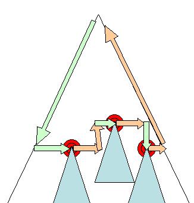
    <p  align=center>
        Рисунок 18: Прирастальная планировка - только грязные визуализаторы и их дети выложены
    </p>
</p>

<br>
<br>

#### Асинхронная и синхронная макет
Инкрементальный макет выполняется асинхронно. Очерки Firefox «Команды рефтова» для инкрементных макетов и планировщик запускают пакетное выполнение этих команд. У Webkit также есть таймер, который выполняет инкрементную макет - дерево пересекается, а «грязные» визуализаторы определяются.

Сценарии, запрашивающие информацию о стиле, такие как «Offsetheight», могут синхронизировать инкрементальный макет.

Глобальный макет обычно запускается синхронно.

Иногда макет запускается как обратный вызов после начального макета, потому что некоторые атрибуты, такие как положение прокрутки.

#### Оптимизации
Когда макет запускается «изменением размера» или изменением позиции рендеринга (а не размера), размеры рендеров взяты из кеша и не пересчитываются…

В некоторых случаях модифицируется только субполовое дерево, а макет не начинается с корня. Это может произойти в тех случаях, когда изменение является локальным и не влияет на его окружение - например, текст, вставленные в текстовые поля (в противном случае каждый клавиш будет вызывать макет, начиная с корня).

#### Процесс макета
Макет обычно имеет следующий шаблон:

1. Родительский рендер определяет свою собственную ширину.
2. Родитель рассказывает о детях и:
    - Поместите дочерний визуализатор (устанавливает его x и y).
    - При необходимости вызывает на вызов ребенка - они грязные или мы находимся в глобальной планировке или по какой -то другой причине - которая вычисляет высоту ребенка.
3. Родитель использует накапливающие высоты детей и высоты краев и прокладки, чтобы установить свою собственную высоту - это будет использоваться родительским родителем.
4. Устанавливает свой грязный бит на ложь.

Firefox использует объект «состояния» (nshtmlreflowstate) в качестве параметра для макета (называется «рефтоу»). Среди прочих государство включает в себя ширину родителей.

Выходной сигнал Firefox Mayout представляет собой объект «метрики» (nshtmlreflowmetrics). Он будет содержать рендеринг вычисленной высоты.

#### Расчет ширины
Ширина рендеринга рассчитывается с использованием ширины контейнеровочного блока, свойства стиля рендеринга «ширина», поля и границы.

Например, ширина следующего div:

```html
<div style="width: 30%"/>
```

Будет рассчитываться Webkit как следующее (Class Renderbox Method Calcdath):

- Ширина контейнера - это максимум доступных контейнеров, и 0. Доступная ширина в этом случае - это контент -прогиба, которая рассчитывается как:

```
clientWidth() - paddingLeft() - paddingRight()
```

Клиентская Whidth и ClientHeight представляют интерьер объекта, за исключением границы и прокрутки.

- Ширина элементов - это атрибут стиля «ширины». Он будет рассчитывать как абсолютное значение путем вычисления процента ширины контейнера.

- Горизонтальные границы и падения теперь добавлены.

До сих пор это был расчет «предпочтительной ширины». Теперь будет рассчитана минимальная и максимальная ширина.

Если предпочтительная ширина больше, то максимальная ширина, максимальная ширина используется. Если это меньше, то минимальная ширина (наименьшая нерушимая единица), то используется минимальная ширина.

Значения кэшируются в случае необходимости макета, но ширина не меняется.

#### Разрыв линии
Когда визуализатор в середине макета решает, что он должен сломаться, рендерер останавливает и распространяет родителя макета, что его нужно сломать. Родитель создает дополнительные визуализаторы и вызывает макет на них.

<br>
<br>

### Рисование <hr>
На стадии рисования дерево рендеринга переселяется, а метод рендеринга «Paint ()» вызывается для отображения контента на экране. Живопись использует компонент инфраструктуры пользовательского интерфейса.

#### Глобальный и постепенный
Как и макет, живопись также может быть глобальной - все дерево окрашено - или постепенно. В постепенной живописи некоторые из рендеристов меняются таким образом, что не влияет на все дерево. Измененный рендерер недействительный свой прямоугольник на экране. Это заставляет ОС видеть ее как «грязную область» и генерирует событие «краски». ОС делает это умно и объединяет несколько регионов в одну. В Chrome это сложнее, потому что рендерер находится в другом процессе, чем в основном процессе. Chrome в некоторой степени имитирует поведение ОС. Презентация слушает эти события и делегирует сообщение в корне рендеринга. Дерево переселяется до тех пор, пока не будет достигнут соответствующий визуализатор. Он перекрасит себя (и обычно его детей).

#### Порядок картины
[CSS2 определяет порядок процесса живописи](https://www.w3.org/TR/CSS21/zindex.html) . На самом деле это порядок, в котором элементы находятся в контексте укладки . Этот порядок влияет на живопись, так как стеки окрашены сзади на спереди. Порядок укладки блок -рендерера:

1. фоновый цвет
2. изображение на заднем плане
3. граница
4. дети
5. контур

#### Список дисплея Firefox
Firefox проходит через дерево рендеринга и строит список дисплеев для окрашенного прямоугольного. Он содержит визуализаторы, имеющие отношение к прямоугольному, в правильном порядке рисования (фоны рендеристов, затем граничат с т. Д.).

Таким образом, дерево нужно пройти только один раз для перекрашивания, а не несколько раз - рисовать все фоны, затем все изображения, затем все границы и т. Д.

Firefox оптимизирует процесс, не добавляя элементы, которые будут скрыты, как элементы, полностью под другими непрозрачными элементами.

__Webkit прямоугольное хранилище__
Перед перекрашением Webkit сохраняет старый прямоугольник как растровый карту. Затем он рисует только дельту между новыми и старыми прямоугольниками.

#### Динамические изменения
Браузеры пытаются выполнить минимальные возможные действия в ответ на изменение. Таким образом, изменения в цвете элемента вызовут только перекрашение элемента. Изменения в позиции элемента приведут к выводу макета и перекрашивания элемента, его детей и, возможно, братьев и сестер. Добавление узла DOM приведет к перекрашению макета и перекрашивания узла. Основные изменения, такие как увеличение размера шрифта элемента «HTML», приведут к недействительности кэша, реле и перекраске всего дерева.

#### Нити двигателя рендеринга
Двигатель рендеринга однооболочный. Почти все, кроме сетевых операций, происходит в одном потоке. В Firefox и Safari это главная нить браузера. В Chrome это основной поток процесса TAB.

Сетевые операции могут быть выполнены несколькими параллельными потоками. Количество параллельных соединений ограничено (обычно 2 - 6 соединений).

#### Петля мероприятия
Основная поток браузера - это цикл событий. Это бесконечный цикл, который поддерживает процесс. Он ждет событий (например, макет и краски) и обрабатывает их. Это код Firefox для основного цикла событий:

```javascript
while (!mExiting)
    NS_ProcessNextEvent(thread);
```

<br>
<br>

### Визуальная модель CSS2 <hr>
#### Холст
Согласно [спецификации CSS2](https://www.w3.org/TR/CSS21/intro.html#processing-model) , термин Canvas описывает «пространство, где визуализируется структура форматирования»: где браузер рисует содержание.

Холст бесконечен для каждого измерения пространства, но браузеры выбирают начальную ширину, основанную на размерах видового порта.

Согласно www.w3.org/tr/css2/zindex.html , холст является прозрачным, если он содержится в другом, и дается определенный браузер, определенный цвет, если это не так.

#### CSS Box Model
Модель [коробки CSS](https://www.w3.org/TR/CSS2/box.html) описывает прямоугольные коробки, которые генерируются для элементов в дереве документов и выложены в соответствии с моделью визуального форматирования.

Каждая коробка имеет область содержания (например, текст, изображение и т. Д.) И дополнительные окружающие прокладки, границы и поля.

<p align=center>
    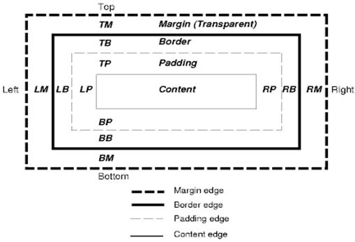
    <p align=center>
        Рисунок 19: Модель коробки CSS2
    </p>
</p>

Каждый узел генерирует 0… N таких коробок.

Все элементы имеют свойство «отображения», которое определяет тип коробки, который будет сгенерирован.

Примеры:

```css
block: generates a block box.
inline: generates one or more inline boxes.
none: no box is generated.
```
По умолчанию встроенный, но лист в стиле браузера может установить другие значения по умолчанию. Например: дисплей по умолчанию для элемента "div" - это блок.

Вы можете найти пример листа стиля по умолчанию здесь: www.w3.org/tr/css2/sample.html .

#### Схема позиционирования
Есть три схемы:

1. Нормальный: объект расположен в соответствии с его местом в документе. Это означает, что его место в дереве рендеринга похоже на его место в дереве DOM и выложено в соответствии с типом и размерами коробки
2. Float: объект сначала выложен как нормальный поток, затем перемещается как можно дальше влево или вправо, насколько это возможно
3. Абсолют: объект помещается в дерево рендеринга в другом месте, чем в дереве DOM

Схема позиционирования устанавливается свойством «позиции» и атрибутом «float».

- статический и относительный вызван нормальный поток
- Абсолютное и фиксированное вызывает абсолютное позиционирование

В статическом позиционировании позиция не определено, и используется позиционирование по умолчанию. В других схемах автор указывает позицию: вверху, внизу, слева, справа.

То, как выложенная коробка, определяется:
- Тип коробки
- Размеры коробки
- Схема позиционирования
- Внешняя информация, такая как размер изображения и размер экрана

#### Типы коробок
Блок -коробка: образует блок - имеет свой собственный прямоугольник в окне браузера.

<p align=center>
    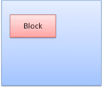
    <p align=center>
        Рисунок 20: Блок -коробка
    </p>
</p>


Встроенная коробка: не имеет своего собственного блока, но находится внутри блока.

<p align=center>
    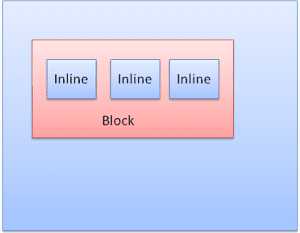
    <p align=center>
        Рисунок 21: Встроенные коробки
    </p>
</p>

Блоки отформатированы вертикально один за другой. Встроенные отформатированы горизонтально.

<p align=center>
    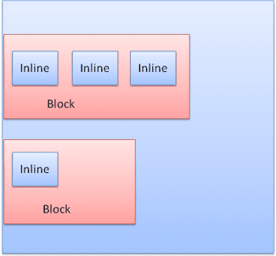
    <p align=center>
        Рисунок 22: Блок и встроенный форматирование
    </p>
</p>

Встроенные ящики помещают внутри линии или «линейные коробки». Линии, по крайней мере, такие же высокие, как самая высокая коробка, но могут быть выше, когда коробки выровнены «базовый уровень», что означает, что нижняя часть элемента выровнена в точке другой коробки, кроме нижнего. Если ширины контейнера недостаточно, встроенные встроены на несколько строк. Обычно это то, что происходит в абзаце.
<p align=center>
    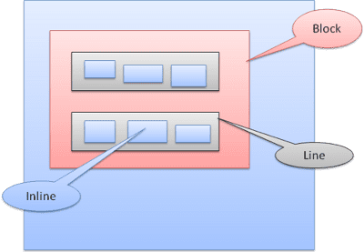
    <p align=center>
        Рисунок 23: Линии
    </p>
</p>

#### Позиционирование
__Родственник__
Относительное позиционирование - расположено как обычно, а затем перемещено необходимой дельтой.
<p align=center>
    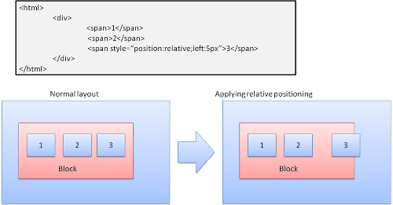
    <p align=center>
        Рисунок 24: Относительное позиционирование
    </p>
</p>

__Плавает__
Ящик с поплавкой смещена влево или справа от линии. Интересная особенность заключается в том, что другие коробки текут вокруг него. HTML:

```html
<p>
  
  Lorem ipsum dolor sit amet, consectetuer...
</p>
```
Будет выглядеть как:
<p align=center>
    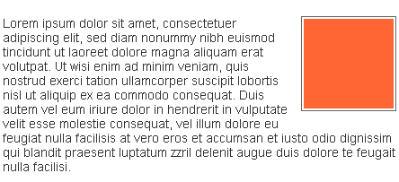
    <p align=center>
        Рисунок 25: Поплавок
    </p>
</p>

__Абсолютный и фиксированный__
Макет определяется точно так же, независимо от нормального потока. Элемент не участвует в нормальном потоке. Размеры относительно контейнера. В фиксированном контейнере является товар для просмотра.
<p align=center>
    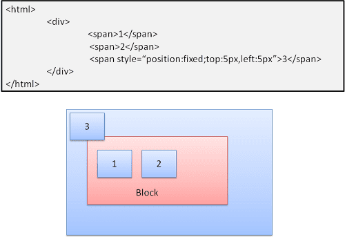
    <p align=center>
        Рисунок 26: Фиксированное позиционирование
    </p>
</p>

> Примечание: фиксированная коробка не будет двигаться, даже когда документ будет прокручен!

<br>

#### Многослойное представление
Это указывает свойство z-Index CSS. Он представляет третье измерение коробки: его положение вдоль «оси z».

Ящики разделены на стеки (называемые контекстами укладки). В каждом стеке обратные элементы будут нарисованы первыми, а прямые элементы сверху, ближе к пользователю. В случае перекрытия ведущий элемент будет скрывать прежний элемент.

Стеки заказаны в соответствии с свойством Z-Index. Ящики со свойством "z-Index" образуют локальный стек. В Viewport есть внешний стек.

Пример:

```CSS
<style type="text/css">
  div {
    position: absolute;
    left: 2in;
    top: 2in;
  }
</style>

<p>
  <div
    style="z-index: 3;background-color:red; width: 1in; height: 1in; ">
  </div>
  <div
    style="z-index: 1;background-color:green;width: 2in; height: 2in;">
  </div>
</p>
```
Результатом будет следующее:
<p align=center>
    
    <p align=center>
        Рисунок 27: Фиксированное позиционирование
    </p>
</p>

Хотя Red Div предшествует зеленому в наценке и был бы нарисован ранее в обычном потоке, свойство Z-Index выше, поэтому оно более вперед в стеке, удерживаемой корневым ящиком.