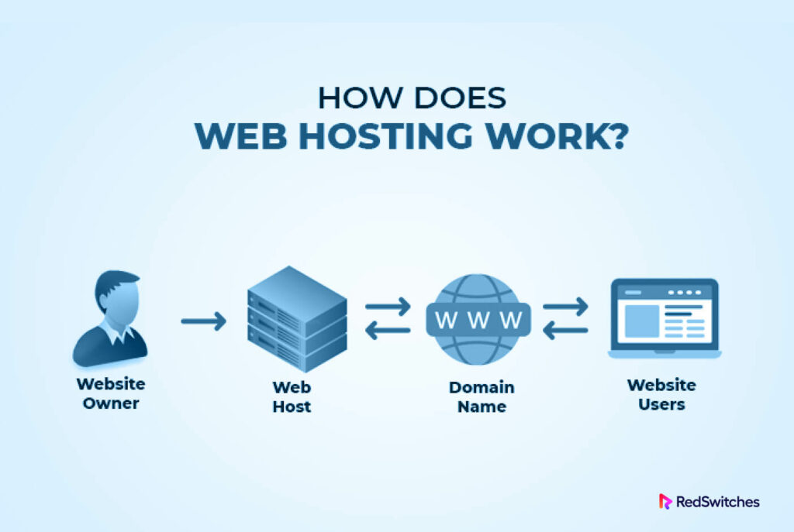

# Web hosting is an online service that allows you to publish your website files onto the internet. So, anyone who has access to the internet has access to your website.

# Веб-хостинг — это онлайн-сервис, который позволяет публиковать файлы вашего веб-сайта в Интернете. Таким образом, любой, у кого есть доступ к Интернету, имеет доступ к вашему сайту.

