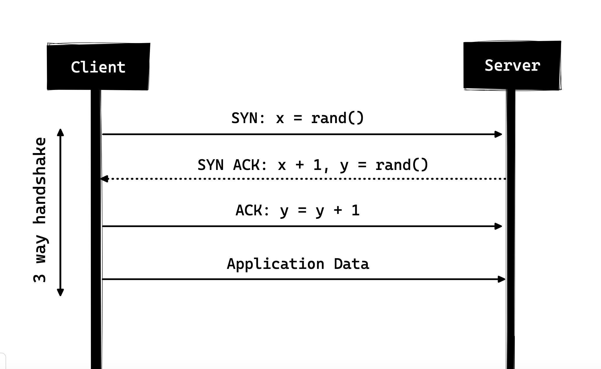
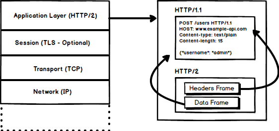

# Все, что вам нужно знать о HTTP

HTTP — это протокол, который должен знать каждый веб-разработчик, поскольку он обеспечивает работу всей сети. Знание HTTP, безусловно, может помочь вам разрабатывать более качественные приложения.

В этой статье я расскажу, что такое HTTP, как он появился, где он находится сегодня и как мы сюда пришли.

### Что такое HTTP?
Прежде всего, что такое HTTP? HTTP — это протокол связи прикладного уровня на основе TCP/IP, который стандартизирует взаимодействие клиентов и серверов друг с другом. Он определяет, как контент запрашивается и передается через Интернет. Под протоколом прикладного уровня я подразумеваю, что это просто уровень абстракции, который стандартизирует взаимодействие хостов (клиентов и серверов). Сам HTTP зависит от TCP/IP для получения запросов и ответов между клиентом и сервером. По умолчанию используется TCP-порт 80, но можно использовать и другие порты. Однако HTTPS использует порт 443.

### HTTP/0.9 - Один лайнер (1991)
Первой документированной версией HTTP был HTTP/0.9 , представленный в 1991 году. Это был самый простой протокол на свете; наличие одного метода под названием GET. Если бы клиенту нужно было получить доступ к какой-либо веб-странице на сервере, он бы сделал простой запрос, как показано ниже.

`
GET /index.html
`

И ответ от сервера выглядел бы следующим образом

```
(response body)
(connection closed)
```

То есть сервер получит запрос, ответит HTML-кодом в ответ, и как только контент будет передан, соединение будет закрыто. Было

<ul>
<li>Нет заголовков</li>
<li>'GET' - был единственным разрешенным методом</li>
<li>Ответ должен быть HTML.</li>
</ul>

Как видите, протокол на самом деле был не чем иным, как ступенькой к тому, что должно было произойти.

### HTTP/1.0 – 1996 г.
В 1996 году появилась следующая версия HTTP, то есть HTTP/1.0, которая значительно улучшилась по сравнению с исходной версией.

В отличие от HTTP/0.9, который был разработан только для ответов HTML, HTTP/1.0 теперь может работать и с другими форматами ответов, например изображениями, видеофайлами, обычным текстом или любым другим типом контента. Добавлено больше методов (т. е. POST и HEAD), изменены форматы запросов/ответов, HTTP-заголовки добавлены как к запросу, так и к ответам, добавлены коды состояния для идентификации ответа, введена поддержка набора символов, многочастные типы, авторизация , кеширование, кодирование контента и многое другое.

Вот как мог бы выглядеть пример запроса и ответа HTTP/1.0:

```
GET / HTTP/1.0
Host: cs.fyi
User-Agent: Mozilla/5.0 (Macintosh; Intel Mac OS X 10_10_5)
Accept: */*
```
Как вы можете видеть, вместе с запросом клиент также отправил свою личную информацию, требуемый тип ответа и т. д. В то время как в HTTP/0.9 клиент никогда не мог отправить такую ​​информацию, потому что не было заголовков.

Пример ответа на запрос выше мог выглядеть так, как показано ниже.


```HTTP/1.0 200 OK
Content-Type: text/plain
Content-Length: 137582
Expires: Thu, 05 Dec 1997 16:00:00 GMT
Last-Modified: Wed, 5 August 1996 15:55:28 GMT
Server: Apache 0.84

(response body)
(connection closed)
```

В самом начале ответа есть HTTP/1.0 (HTTP, за которым следует номер версии), затем код состояния 200, за которым следует фраза причины (или описание кода состояния, если хотите).

В этой новой версии заголовки запросов и ответов по-прежнему сохранялись в кодировке ASCII, но тело ответа могло быть любого типа, например, изображения, видео, HTML, обычного текста или любого другого типа контента. Итак, теперь этот сервер может отправлять клиенту контент любого типа; вскоре после появления термин «гипертекст» в HTTP стал использоваться неправильно. HMTP или протокол передачи Hypermedia, возможно, имели бы больше смысла, но, я думаю, мы застряли с этим названием на всю жизнь.

Одним из основных недостатков HTTP/1.0 было отсутствие нескольких запросов на одно соединение. То есть всякий раз, когда клиенту понадобится что-то от сервера, ему придется открыть новое TCP-соединение, и после того, как этот единственный запрос будет выполнен, соединение будет закрыто. И для любого следующего требования потребуется новое соединение. Почему это плохо? Итак, давайте предположим, что вы посещаете веб-страницу, содержащую 10 изображений, 5 таблиц стилей и 5 файлов JavaScript, всего 20 элементов, которые необходимо получить при выполнении запроса на эту веб-страницу. Поскольку сервер закрывает соединение, как только запрос будет выполнен, будет создана серия из 20 отдельных соединений, в которых каждый из элементов будет обслуживаться один за другим в своих отдельных соединениях. Такое большое количество подключений приводит к серьезному снижению производительности, поскольку требование нового TCP-соединения приводит к значительному снижению производительности из-за трехстороннего установления связи с последующим медленным запуском.


### Трехстороннее рукопожатие
Трехстороннее рукопожатие в его простой форме заключается в том, что все TCP-соединения начинаются с трехстороннего рукопожатия, при котором клиент и сервер передают серию пакетов перед тем, как начать совместное использование данных приложения.
<ul>
<li>SYN — Клиент выбирает случайное число, скажем, x, и отправляет его на сервер.</li>
<li>SYN ACK — сервер подтверждает запрос, отправляя пакет ACK обратно клиенту, который состоит из случайного числа, скажем, y, выбранного сервером, и числа x+1, где x — число, отправленное клиентом.</li>
<li>ACK — клиент увеличивает число y, полученное от сервера, и отправляет обратно пакет ACK с номером y+1.</li>
</ul>


После завершения трехстороннего рукопожатия может начаться обмен данными между клиентом и сервером. Следует отметить, что клиент может начать отправку данных приложения, как только он отправит последний пакет ACK, но серверу все равно придется ждать получения пакета ACK, чтобы выполнить запрос.



Однако некоторые реализации HTTP/1.0 пытались решить эту проблему, вводя новый заголовок Connection: Keep-Alive, который должен был сообщать серверу: «Эй, сервер, не закрывай это соединение, оно мне нужно снова». Но, тем не менее, это не получило такой широкой поддержки, и проблема все еще сохранялась.

Помимо того, что HTTP не требует установления соединения, он также является протоколом без сохранения состояния, т. е. сервер не хранит информацию о клиенте, и поэтому каждый из запросов должен иметь информацию, необходимую серверу для выполнения запроса самостоятельно, без какой-либо связи с каким-либо старым Запросы. И это подливает масла в огонь, т.е. помимо большого количества соединений, которые клиент должен открыть, ему также приходится отправлять по сети некоторые избыточные данные, что приводит к увеличению использования полосы пропускания.

### HTTP/1.1 – 1997 г.

Спустя всего три года существования HTTP/1.0 следующая версия, то есть HTTP/1.1, была выпущена в 1999 году; который внес множество улучшений по сравнению со своим предшественником. Основные улучшения по сравнению с HTTP/1.0 включали

<ul>
<li>Были добавлены новые методы HTTP, включающие PUT, PATCH, OPTIONS, DELETE.

<li>Идентификация имени хоста В HTTP/1.0 заголовок хоста не требовался, но HTTP/1.1 сделал его обязательным.

<li>Постоянные соединения Как обсуждалось выше, в HTTP/1.0 на каждое соединение был только один запрос, и соединение закрывалось, как только запрос был выполнен, что приводило к резкому снижению производительности и проблемам с задержкой. В HTTP/1.1 появились постоянные соединения, т.е. соединения по умолчанию не закрывались, а оставались открытыми, что позволяло выполнять несколько последовательных запросов. Чтобы закрыть соединения, в запросе должен быть доступен заголовок Connection: close. Клиенты обычно отправляют этот заголовок в последнем запросе, чтобы безопасно закрыть соединение.

<li>Конвейерная обработка Также была введена поддержка конвейерной обработки, при которой клиент мог отправлять несколько запросов на сервер, не дожидаясь ответа от сервера по одному и тому же соединению, а сервер должен был отправлять ответ в той же последовательности, в которой были получены запросы. Но как клиент узнает, что на этом этапе загрузка первого ответа завершается и начинается контент для следующего ответа, спросите вы! Что ж, чтобы решить эту проблему, должен присутствовать заголовок Content-Length, который клиенты могут использовать, чтобы определить, где заканчивается ответ, и начать ожидать следующего ответа.

<br>
<br>

>Следует отметить, что для получения преимуществ от постоянных соединений или конвейерной обработки заголовок Content-Length должен быть доступен в ответе, поскольку это позволит клиенту узнать, когда передача завершится, и он сможет отправить следующий запрос (обычным последовательным способом). отправка запросов) или начать ждать следующего ответа (когда конвейерная обработка включена).

>Но с этим подходом все еще оставалась проблема. А что, если данные являются динамическими и сервер не может заранее определить длину контента? Что ж, в таком случае постоянные связи действительно не принесут никакой пользы, не так ли?! Чтобы решить эту проблему, в HTTP/1.1 введено фрагментированное кодирование. В таких случаях сервер может опустить Content-Length в пользу фрагментированного кодирования (подробнее об этом чуть позже). Однако если ни один из них недоступен, соединение необходимо закрыть в конце запроса.

<li>Фрагментированная передача. В случае динамического контента, когда сервер не может определить длину контента при начале передачи, он может начать отправлять контент по частям (частично) и добавлять длину контента для каждого фрагмента при его отправке. . И когда все фрагменты отправлены, т. е. вся передача завершена, он отправляет пустой фрагмент, т. е. тот, у которого Content-Length установлен в ноль, чтобы идентифицировать клиента, передача которого завершилась. Чтобы уведомить клиента о фрагментированной передаче, сервер включает заголовок Transfer-Encoding: chunked
<br>
<br>
<li>В отличие от HTTP/1.0, который имел только базовую аутентификацию, HTTP/1.1 включал дайджест-аутентификацию и аутентификацию прокси.
<br>
<br>
<li>Кэширование
<li>Байтовые диапазоны
<li>Наборы символов
<li>Языковые переговоры
<li>Клиентские файлы cookie
<li>Расширенная поддержка сжатия
<li>Новые коды статуса
<li>..и более

</ul>

Я не буду подробно останавливаться на всех возможностях HTTP/1.1 в этом посте, поскольку это отдельная тема, и вы уже можете многое о ней найти. Единственный такой документ, который я бы порекомендовал вам прочитать, — «Ключевые различия между HTTP/1.0 и HTTP/1.1».

HTTP/1.1 был представлен в 1999 году и на протяжении многих лет оставался стандартом. Хотя он значительно улучшился по сравнению со своим предшественником; Поскольку сеть меняется каждый день, она начала показывать свой возраст. Загрузка веб-страницы в наши дни требует больше ресурсов, чем когда-либо. В наши дни простая веб-страница должна открывать более 30 соединений. Ну, у HTTP/1.1 есть постоянные соединения, тогда почему так много соединений? ты говоришь! Причина в том, что в HTTP/1.1 в любой момент времени может быть только одно действующее соединение. HTTP/1.1 пытался исправить это, введя конвейерную обработку, но он не решил проблему полностью из-за блокировки начала строки, когда медленный или тяжелый запрос может блокировать последующие запросы, и как только запрос застревает в конвейере, он придется ждать выполнения следующих запросов. Чтобы преодолеть эти недостатки HTTP/1.1, разработчики начали внедрять обходные пути, например, использование спрайт-таблиц, изображений, закодированных в CSS, отдельных огромных файлов CSS/Javascript, сегментирования домена и т. д.

### СПДИ - 2009
Google пошел дальше и начал экспериментировать с альтернативными протоколами, чтобы сделать Интернет быстрее и повысить веб-безопасность, одновременно сокращая задержку веб-страниц. В 2009 году они анонсировали SPDY.

>SPDY является товарным знаком Google и не является аббревиатурой.

Было замечено, что если мы продолжаем увеличивать пропускную способность, производительность сети вначале увеличивается, но наступает момент, когда прирост производительности незначителен. Но если вы сделаете то же самое с задержкой, то есть если мы продолжим снижать задержку, произойдет постоянный прирост производительности. Это была основная идея повышения производительности SPDY: уменьшение задержки для повышения производительности сети.

>Для тех, кто не знает разницы, задержка — это задержка, т. е. время, необходимое данным для перемещения между источником и пунктом назначения (измеряется в миллисекундах), а пропускная способность — это объем данных, передаваемых в секунду (бит в секунду).

В число функций SPDY входят мультиплексирование, сжатие, приоритизация, безопасность и т. д. Я не буду вдаваться в подробности SPDY, так как вы поймете эту идею, когда мы перейдем к подробностям HTTP/2 в следующем разделе, поскольку я сказал, что HTTP/2 в основном основан на SPDY.

SPDY на самом деле не пытался заменить HTTP; это был уровень трансляции через HTTP, который существовал на уровне приложения и изменял запрос перед отправкой его по сети. Он начал становиться стандартом де-факто, и большинство браузеров начали его реализовывать.

В 2015 году в Google не хотели иметь два конкурирующих стандарта, поэтому они решили объединить его с HTTP, одновременно создав HTTP/2 и отказавшись от SPDY.

### HTTP/2 – 2015 г.
К этому моменту вы, должно быть, уже поняли, зачем нам нужна еще одна версия протокола HTTP. HTTP/2 был разработан для передачи контента с низкой задержкой. Ключевые особенности или отличия от старой версии HTTP/1.1 включают в себя:
<ul>
<li>Двоичный вместо текстового
<li>Мультиплексирование — несколько асинхронных HTTP-запросов по одному соединению.
<li>Сжатие заголовка с использованием HPACK
<li>Server Push — несколько ответов на один запрос
<li>Приоритизация запросов
<li>Безопасность
</ul>



#### 1. Бинарный протокол
HTTP/2 имеет тенденцию решать проблему повышенной задержки, существовавшую в HTTP/1.x, делая его двоичным протоколом. Поскольку протокол является двоичным, его легче анализировать, но в отличие от HTTP/1.x он больше не читается человеческим глазом. Основными строительными блоками HTTP/2 являются фреймы и потоки.

##### Кадры и потоки
HTTP-сообщения теперь состоят из одного или нескольких кадров. Существует кадр HEADERS для метаданных и кадр DATA для полезной нагрузки, а также существует несколько других типов кадров (HEADERS, DATA, RST_STREAM, SETTINGS, PRIORITY и т. д.), которые вы можете проверить в спецификациях HTTP/2 .

Каждому запросу и ответу HTTP/2 присваивается уникальный идентификатор потока, который делится на кадры. Фреймы — это не что иное, как двоичные фрагменты данных. Коллекция кадров называется потоком. Каждый кадр имеет идентификатор потока, который идентифицирует поток, которому он принадлежит, и каждый кадр имеет общий заголовок. Кроме того, помимо уникальности идентификатора потока, стоит отметить, что любой запрос, инициированный клиентом, использует нечетные числа, а ответ от сервера имеет идентификаторы потока с четными числами.

Помимо HEADERS и DATA, я думаю, что здесь стоит упомянуть еще один тип кадра — RST_STREAM, который представляет собой специальный тип кадра, который используется для прерывания некоторого потока, т. е. клиент может отправить этот кадр, чтобы сообщить серверу, что мне не нужен этот поток. больше. В HTTP/1.1 единственным способом заставить сервер прекратить отправку ответа клиенту было закрытие соединения, что приводило к увеличению задержки, поскольку для любых последовательных запросов приходилось открывать новое соединение. В HTTP/2 клиент может использовать RST_STREAM и прекратить получение определенного потока, в то время как соединение все еще будет открыто, а другие потоки все еще будут использоваться.

#### 2. Мультиплексирование
Поскольку HTTP/2 теперь является двоичным протоколом и, как я сказал выше, он использует кадры и потоки для запросов и ответов, после открытия TCP-соединения все потоки отправляются асинхронно через одно и то же соединение без открытия каких-либо дополнительных соединений. И, в свою очередь, сервер отвечает таким же асинхронным образом, т.е. ответ не имеет порядка, и клиент использует назначенный идентификатор потока для идентификации потока, которому принадлежит конкретный пакет. Это также решает проблему блокировки начала строки, существовавшую в HTTP/1.x, т. е. клиенту не придется ждать запроса, который занимает время, а другие запросы все равно будут обрабатываться.

#### 3. Сжатие заголовка
Это была часть отдельного RFC, специально направленного на оптимизацию отправляемых заголовков. Суть этого в том, что когда мы постоянно обращаемся к серверу от одного и того же клиента, существует много избыточных данных, которые мы отправляем в заголовках снова и снова, а иногда могут быть файлы cookie, увеличивающие размер заголовков, что приводит к использованию полосы пропускания и увеличенная задержка. Чтобы преодолеть эту проблему, в HTTP/2 было введено сжатие заголовков.

В отличие от запроса и ответа, заголовки не сжимаются в форматах gzip или compress и т. д., но существует другой механизм сжатия заголовков, который заключается в том, что литеральные значения кодируются с использованием кода Хаффмана, а таблица заголовков поддерживается клиентом и сервером, а также клиентом. и сервер опускают любые повторяющиеся заголовки (например, пользовательский агент и т. д.) в последующих запросах и ссылаются на них, используя таблицу заголовков, поддерживаемую обоими.

Раз уж мы говорим о заголовках, позвольте мне добавить, что заголовки остались такими же, как и в HTTP/1.1, за исключением добавления некоторых псевдозаголовков, например `:method`, `:scheme ` и `:host`, `:path`

#### 4. Серверная рассылка
Серверная передача — еще одна замечательная особенность HTTP/2, где сервер, зная, что клиент собирается запросить определенный ресурс, может отправить его клиенту даже без запроса клиента. Например, предположим, что браузер загружает веб-страницу, анализирует всю страницу, чтобы найти удаленный контент, который ему необходимо загрузить с сервера, а затем отправляет последовательные запросы на сервер для получения этого контента.

Принудительная передача данных сервером позволяет серверу сократить число обращений туда и обратно, отправляя данные, которые, как он знает, потребуются клиенту. Это делается так: сервер отправляет специальный кадр под названием PUSH_PROMISE, уведомляя клиента: «Эй, я собираюсь отправить вам этот ресурс! Не проси меня об этом». Кадр PUSH_PROMISE связан с потоком, вызвавшим отправку, и содержит идентификатор обещанного потока, т. е. поток, в который сервер отправит ресурс для отправки.

#### 5. Расстановка приоритетов запросов
Клиент может назначить приоритет потоку, включив информацию о приоритете в кадр HEADERS, с помощью которого открывается поток. В любое другое время клиент может отправить кадр PRIORITY, чтобы изменить приоритет потока.

Без какой-либо информации о приоритете сервер обрабатывает запросы асинхронно, то есть без какого-либо порядка. Если потоку назначен приоритет, то на основе этой информации о приоритетах сервер решает, сколько ресурсов необходимо выделить для обработки того или иного запроса.

#### 6. Безопасность
Было широкое обсуждение того, следует ли сделать безопасность (через TLS) обязательной для HTTP/2 или нет. В итоге было решено не делать это обязательным. Однако большинство поставщиков заявили, что они будут поддерживать HTTP/2 только при его использовании через TLS. Таким образом, хотя HTTP/2 не требует шифрования по спецификациям, он все равно стал обязательным по умолчанию. Несмотря на это, HTTP/2, реализованный через TLS, налагает некоторые требования, т.е. Необходимо использовать TLS версии 1.2 или выше, должен быть определенный уровень минимальных размеров ключей, требуются эфемерные ключи и т. д.